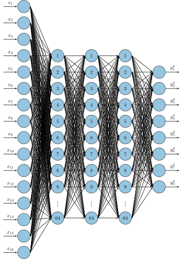

.. _uz_mlp_three_layer:

==================
uz_mlp_three_layer
==================

This IP-Core implements a three layer MLP network based on [#realTimeInference]_.
The implementation and nomenclature follows the principles outlined in :ref:`uz_nn`.
The MLP is hard coded to have three hidden layer with :ref:`activation_function_relu` activation function for hidden layers.
The output uses :ref:`activation_function_linear` activation.

   Implemented MLP network of the IP-Core

.. warning: This IP-Core can not be simulated with Simulink at the moment since it depends on an internal library.
            However, the IP-Core can be used as-is.
            If you want to contribute to improve the IP-Core, please get in touch. 

Features:

- Feedforward calculation in fixed point (32 bit, 14 fractional bits, signed)
- Precision: 6.1e-5
- Max values: +/- 131072
- No overflow detection regarding the fixed point data type! User has to make sure that min/max is not violated
- Variable number of inputs which can be configured by software from 2 to 16
- Variable number of outputs which can be configured by software (2,4,6,8).
- Number of hidden layers is fixed to 3!
- Number of neurons in each hidden layer is fixed to 64!
- Activation function is :ref:`activation_function_relu` for all hidden layer (with a saturation at max value!)
- Activation function is :ref:`activation_function_linear` for output layer
- Bias and weights can be written to the network at runtime
- Fully compatible with :ref:`uz_nn` to use IP-Core as an accelerator
- Uses :ref:`uz_matrix` as input and outputs

Usage
=====

Concurrent execution
********************

The regular calculation with the IP-Core using the software driver and writing the inputs by AXI (``use_axi_inputs`` is true) is a blocking operation.
The driver triggers the calculation and waits until it is finished.
The processor can not do any other tasks.

.. code-block::

    uz_mlp_three_layer_ff_blocking(instance, input, output); // Takes 30us (example)
    uz_sleep_useconds(10);                                   // Takes 10us
                                                             // Takes 40us total

.. mermaid::

   sequenceDiagram
       participant Processor
       participant Driver
       Processor->>Driver: uz_mlp_three_layer_ff_blocking
       Driver->>IP-Core: Write input
       Driver->>IP-Core: Trigger calculation
       loop
           Driver->>IP-Core: Read valid output
           Driver->>Driver: Valid output true?
       end
       Driver->>IP-Core: Read output
       Driver->>Processor: Return output values

An alternative to the blocking calculation is a concurrent approach.
In this, the IP-Core calculation is triggered, the processor is free to do other tasks, and the data is fetched after the calculation is finished.
This way the calculation between trigger and get result does not add to the total required time if the task in between takes less time than the IP-Core calculation.
Note that this means the actual calculation time of network without the communication overhead of the read/write operations. 

.. code-block::

    uz_mlp_three_layer_ff_trigger(instance, input);                 // Takes 30us (example)
    uz_sleep_useconds(10);                                          // Takes 10us 
    uz_mlp_three_layer_ff_get_result_blocking(instance, output);
                                                                    // Takes 30us total

.. mermaid::

   sequenceDiagram
       participant Processor
       participant Driver
       Processor->>Driver: uz_mlp_three_layer_ff_trigger
       Driver->>IP-Core: Write input
       Driver->>IP-Core: Trigger calculation
       Driver->>Processor: return
       Processor->>Software: Do something else
       Software->>Processor: return
       Processor->>Driver: uz_mlp_three_layer_ff_get_result_blocking
       loop
           Driver->>IP-Core: Read valid output
           Driver->>Driver: Valid output true?
       end
       Driver->>IP-Core: Read output
       Driver->>Processor: Return output values

Driver reference
****************

.. doxygentypedef:: uz_mlp_three_layer_ip_t

.. doxygenstruct:: uz_mlp_three_layer_ip_config_t
    :members:

.. doxygenfunction:: uz_mlp_three_layer_ip_init

.. doxygenfunction:: uz_mlp_three_layer_ff_blocking

.. doxygenfunction:: uz_mlp_three_layer_ff_trigger

.. doxygenfunction:: uz_mlp_three_layer_ff_get_result_blocking

.. doxygenfunction:: uz_mlp_three_layer_ff_blocking_unsafe

Implementation details
======================

Configuration
*************

The IP-Core has the following configuration possibilities.

enable_nn

  Calculates one feedforward pass of the network with the current inputs. Calculation start on a rising edge of ``enable_nn``.

use_axi_input

  Network uses the FPGA inputs for the feedforward pass if ``use_axi_input`` is FALSE. If ``use_axi_input`` is true, the inputs from the AXI signals are used.

axi_number_of_inputs

  Sets the number of inputs of the network.
  ``axi_number_of_inputs`` can be set to any value between 2 and 16.
  The value has to be consistent with the values for bias and weights that are stored in the IP-Core!

axi_output_number_configuration

  Sets the number of outputs of the network.
  ``axi_output_number_configuration`` can be set to 2, 4, 6, or 8 outputs.
  The value in this config register has to be set to :math:`(number\_of\_outputs/2)-1`.

Output scheme
*************

The output is always a vector with 8 elements, independent of the number of used outputs of the network that are configured by AXI.
Due to the parallel calculation of the result, the following output mapping applies.

For 8 outputs:

.. math::

   y=\begin{bmatrix} y_1 & y_2 & y_3 & y_4 & y_5 &  y_6 &  y_7 & y_8 \end{bmatrix} 

For 6 outputs:

.. math::

   y=\begin{bmatrix} y_1 & y_2 & y_3 & 0 & y_4 &  y_5 &  y_6 & 0 \end{bmatrix} 

For 4 outputs:

.. math::

   y=\begin{bmatrix} y_1 & y_2 & 0 & 0 & y_3 &  y_4 &  0 & 0 \end{bmatrix} 

For 2 outputs:

.. math::

   y=\begin{bmatrix} y_1 & 0 & 0 & 0 & y_2 &  0 & 0 & 0 \end{bmatrix} 

Parallel calculation
********************

The calculation of the network is split up and done in parallel to speed it up.
The split up is done on a neuron basis in each layer, i.e., with a parallelization of 4, four DSP slices are used and each DSP calculates 1/4 of the output vector independent of each other.

Example with four inputs, parallelization of four, and eight neurons:

.. math::

    x &=\begin{bmatrix} 1 & 2 & 3 & 4 \end{bmatrix} \\
    w &=\begin{bmatrix}  \color{red} 1 &  \color{red} 2 & 3 & 4 & \color{green}5 & \color{green}6 & 7 & 8\\ \color{red} 9 & \color{red} 10 & 11 & 12 & \color{green}13 &\color{green} 14 & 15 & 16  \\  \color{red}17 &  \color{red}18 & 19 & 20 & \color{green}21 & \color{green}22 & 23 & 24 \\  \color{red}25 &  \color{red}26 & 27 & 28 & \color{green} 29 & \color{green}30 & 31 & 32 \end{bmatrix} \\
    b &=\begin{bmatrix} 1 & 2 & 3 & 4 & 5 & 6 & 7 & 8 \end{bmatrix}

The multiplication :math:`xw` is split up by splitting :math:`w` into 4 parts.

.. math::

    w_1 &= \begin{bmatrix}  \color{red}1 &  \color{red}2 \\  \color{red}9 &  \color{red}10 \\  \color{red}17 &  \color{red}18 \\  \color{red}25 &  \color{red}26 \end{bmatrix} \\
    w_2 &= \begin{bmatrix} 3 & 4 \\ 11 & 12 \\ 19 & 20 \\ 27 & 28 \end{bmatrix} \\
    w_3 &= \begin{bmatrix} \color{green} 5 & \color{green}6 \\ \color{green}13 &\color{green} 14 \\ \color{green}21 & \color{green}22 \\ \color{green}29 &\color{green} 30 \end{bmatrix} \\
    w_4 &= \begin{bmatrix} 7 & 8 \\ 15 & 16 \\ 23 & 24 \\ 31 & 32 \end{bmatrix} 

The bias is split up by splitting :math:`b` into 4 parts.

.. math::

    b_1 &= \begin{bmatrix}  \color{red}1 &  \color{red}2  \end{bmatrix} \\
    b_2 &= \begin{bmatrix} 3 & 4 \end{bmatrix} \\
    b_3 &= \begin{bmatrix} \color{green} 5 & \color{green}6  \end{bmatrix} \\
    b_4 &= \begin{bmatrix} 7 & 8 \end{bmatrix} 

The results are calculated by:

.. math::

    y_1 &= x w_1 + b_1=\begin{bmatrix} 171  & 182 \end{bmatrix}\\ 
    y_2 &= x w_2 + b_2=\begin{bmatrix} 193  & 204 \end{bmatrix}\\
    y_3 &= x w_3 + b_3=\begin{bmatrix} 215  & 226 \end{bmatrix}\\
    y_4 &= x w_4 + b_4=\begin{bmatrix} 237  & 248 \end{bmatrix} \\
    y &= \begin{bmatrix} 171 & 182 & 193 & 204 & 215 & 226 & 237 & 248 \end{bmatrix}

The weight parameters are written to block RAM (BRAM) in the IP-Core for each layer with the following memory layout:

.. math::

    w =\begin{bmatrix}  1 & 2 & 3 & 4 & 5 & 6 & 7 & 8\\  9 &  10 & 11 & 12 & 13 & 14 & 15 & 16  \\  17 &  18 & 19 & 20 & 21 & 22 & 23 & 24 \\ 25 & 26 & 27 & 28 & 29 & 30 & 31 & 32 \end{bmatrix}

.. math::

    w =\begin{bmatrix}  1& 9& 17& 25& 2& 10& 18& 26& 3& 11& 19& 27& 4& 12& 20& 28& 5& 13& 21& 29& 6& 14& 22& 30& 7& 15& 23& 31& 8& 16& 24& 32 \end{bmatrix}

The bias parameters are written to block RAM (BRAM) in the IP-Core for each layer with the following memory layout:

.. math::

    w =\begin{bmatrix}  1 & 2 & 3 & 4 & 5 & 6 & 7 & 8 \end{bmatrix}

Due to the parallelization, the matrix is split, e.g., into four parts for four parallel DSPs:

.. math::

    w_1 &= \begin{bmatrix} 1 & 9 & 17 & 25 & 2 & 10 & 18 & 26 \end{bmatrix} \\
    w_2 &= \begin{bmatrix} 3 & 11 & 19 & 27 &4 & 12 & 20 & 28\end{bmatrix} \\
    w_3 &= \begin{bmatrix} 5 & 13 & 21 & 29 & 6 &14 & 22 &30 \end{bmatrix} \\
    w_4 &= \begin{bmatrix} 7 & 15 & 23 &31 & 8 & 16 & 24 & 32\end{bmatrix} 

.. note:: This ordering is the transposed definition compared to what is used in :ref:`uz_matrix` to match the hardware setup of the IP-Core. Thus, a matrix of type ``uz_matrix_t`` has to be transposed.

Write parameters to network
***************************

To write parameters to the BRAM of the IP-Core the following mechanism is used:

- Write a zero to ``axi_wrEnBias`` to prevent writes to the wrong address
- Write the number of the layer (one-based, input is 1, first hidden layer is 2, output layer is 4)
- Write data
- Write address (bias is zero-based, weights are one-based)
- Write to enable the number of parallel PCU that shall be set (one-based!) (``axi_wrEnBias``)

For bias:

- Write the address to ``axi_bias_addr``, the address of the bias is zero-based!
- Write the data to ``axi_bias``
- Write the number of the parallel DSP to ``axi_write_bias_enable`` (one-based)

For weights:

- Address is one-based!

Interfaces
==========

.. csv-table:: Interfaces of three layer MLP IP-Core
   :file: ./uz_mlp_interfaces.csv
   :widths: 50 50 50 50 200
   :header-rows: 1

Sources
=======

.. [#realTimeInference] T. Schindler and A. Dietz, "Real-Time Inference of Neural Networks on FPGAs for Motor Control Applications," 2020 10th International Electric Drives Production Conference (EDPC), 2020, pp. 1-6, doi: 10.1109/EDPC51184.2020.9388185.