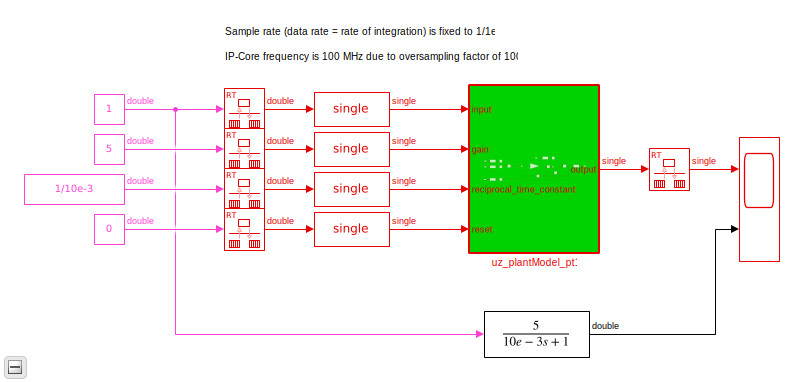
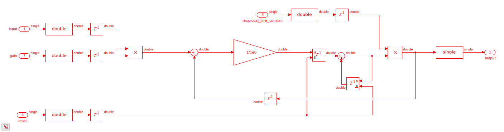

.. _uz_plantModel_pt1:

===============
PT1 plant model
===============

- IP-Core to model a PT1 plant

.. math::

   G(s)=\frac{K}{Ts +1}

With the gain :math:`K` and time constant `T`.

- Intended for HIL/SIL/xIL on the UltraZohm
- PT1 is implemented in discrete time by using *zero order hold* transformation
- Sample time of the integrator is :math:`T_s=\frac{1}{1\,MHz}`
- IP-Core clock frequency **must** be :math:`f_{clk}=100\,MHz`!
- IP-Core has single precision AXI ports
- All calculations in the IP-Core are done in double precision!
- Rationale: the `machine epsilon <https://en.wikipedia.org/wiki/Machine_epsilon>`_ for single precision is approximately :math:`\epsilon=6e-08`. The time discrete integrator multiplies the input with :math:`\frac{1}{T_s}`, resulting in *small* numbers. This results in *noticable* rounding errors for the integration compared to double precision. This effect als consistent between the IP-Core and Simulink, thus double precision is used in the IP-Core. AXI is 32-bit by default, thus the input and output values are converted to single precision.

IP-Core Hardware
================

   Test bench of PT1 plant model IP-Core

   Implementation of plant model PT1 IP-Core

- The module takes all inputs and converts them from single precision to double precision.
- The output is converted from double precision to single precision (using rounding to nearest value in both cases).
- All input values are adjustable at run-time
- The sample time is fixed!
- The IP-Core uses `Native Floating Point of the HDL-Coder <https://de.mathworks.com/help/hdlcoder/native-floating-point.html>`_
- The time constant is written as its reciprocal to the AXI register to make the calculations on hardware simple (handled by the driver!)
- The IP-Core uses an oversampling factor of 100

Driver reference
================

.. doxygentypedef:: uz_plantPT1_t

.. doxygenstruct:: uz_plantPT1_config_t
  :members:

.. doxygenfunction:: uz_plantPT1_init

.. doxygenfunction:: uz_plantPT1_reset_integrator

.. doxygenfunction:: uz_plantPT1_set_input

.. doxygenfunction:: uz_plantPT1_set_gain

.. doxygenfunction:: uz_plantPT1_set_time_constant

.. doxygenfunction:: uz_plantPT1_read_output

Example usage
=============

Vivado
******

- Add IP-Core to Vivado and connect to AXI (smartconnect)
- Source IPCORE_CLK with a :math:`100\,MHz` clock!
- Connect other ports accordingly
- Assign address to IP-Core
- Build bitstream, export .xsa, update vitis platform

.. figure:: uz_plant_model_vivado_example.png
   :width: 800
   :align: center

   Example connection of IP-Core

Vitis
*****

- In a c-file that has `xparameters.h` included
- Initialize the instance and configure it

.. code-block:: c

   struct uz_plantPT1_config_t config={
      .base_address=XPAR_UZ_PLANTMODEL_PT1_0_BASEADDR,
      .ip_core_frequency_Hz=100000000
   };
   pt1=uz_plantPT1_init(config);
   uz_plantPT1_set_gain(pt1,1.0f);
   uz_plantPT1_set_time_constant(pt1,1.0f);
   uz_plantPT1_set_input(pt1,0.0f);

- Write the input and read the output of the block in the `isr.c`
- Add a PI controller to control the PT1 (for example)

.. code-block:: c

   static float error_sum=0;
   float output=uz_plantPT1_read_output(pt1);
   float error=intput-output;
   error_sum+=error;
   float K_p=0.3f;
   float K_i=1.3f;
   float pi_output=K_p*error+K_i*(1.0f/20000.0f)*error_sum; // 20000.0f is the sample rate of the ISR in this example
   uz_plantPT1_set_input(pt1,pi_output);
