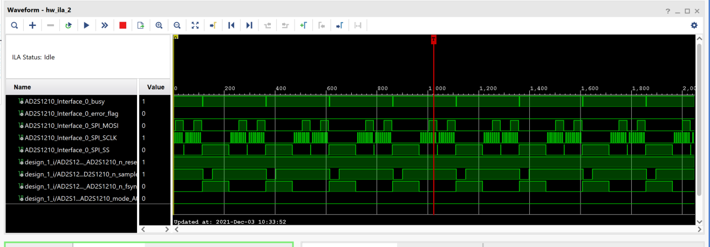

.. _uz_resolverIP:

==================
Resolver Interface
==================

Introduction
============
This IPCore enables communication between the Ultrazohm and the `AD2S1210 <https://www.analog.com/media/en/technical-documentation/data-sheets/AD2S1210.pdf>`_ resolver-to-digital converter. This way resolvers connected to the EncoderBoard V.5JK (Link to JKleinProject) can be read out. 
The IPCore implements Serial 6Mhz SPI Communication which allows for a maximum trigger frequency of 400kHz with a delay between triggering and a new valid value at the output of 2.48us.

Vivado Setup
============
Bild Vivado IP Core
Verbinden mit Pins
Verbinden Trigger
Busy Signal

Entweder hardware triggern und auslesen oder software auslesen

Wertausgabe Timing Bild 

   Example timing

Fehler weitergabe

Vitis Functions
===============

.. doxygenstruct:: uz_resolverIP_t
  :members:

.. doxygenstruct:: uz_resolverIP_config_t
  :members:

.. doxygenfunction:: uz_resolverIP_init

Setup
=====

Hardware

Software

.. code-block:: c
	:caption: Setup in ``main.c``

	init();
	blabla();

La Fin
======