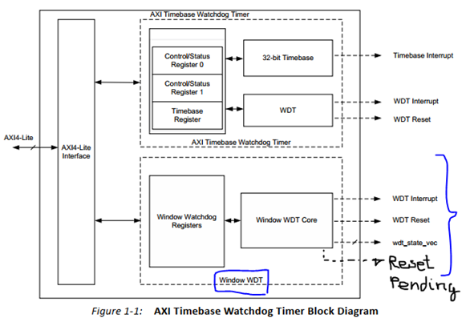

.. _uz_xwdttb:

=================================
AXI Watch Dog Timer Time Based IP
=================================

Due to the lack of precision in the System Watchdog Timer. Set in a minimum of one millisecond in the `Zynq UltraScale+: technical reference manual <https://www.xilinx.com/support/documentation/user_guides/ug1085-zynq-ultrascale-trm.pdf>`_, chapter 14, page 361: Variable timeout period, from 1 ms to 30 seconds using a 100 MHz clock. Although, testing has resulted in 350 microseconds.
Given this poor resolution we decide to integrate the `IP provided by Xilinx <https://www.xilinx.com/support/documentation/ip_documentation/axi_timebase_wdt/v3_0/pg128-axi-timebase-wdt.pdf>`_.

Here we have the IP Block design and its components.

.. _XWDTTB_ModuleOverview:

   Top view of the Module.
   
The IP is divided in two main parts, the Timebase Timer and the Window DWT.
This parts are attached with the two different working modes of the IP. As we can see in the picture,
the chosen working mode will be the Window mode. More complex, and with extended functionality.

Driver function reference
=========================

.. doxygenfunction:: WdtTb_Start

.. doxygenfunction:: WdtTb_Restart

.. doxygenfunction:: uz_WdtTb_init

.. doxygenfunction:: uz_WdtTb_init_device

.. doxygenfunction:: WinWdtIntrExample

.. doxygenfunction:: WdtTbIntrHandler