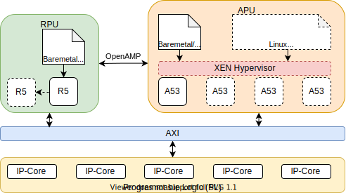
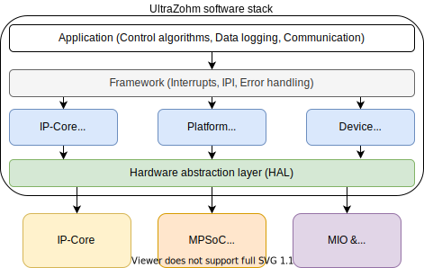

.. _platform_architecture:

=====================
Platform Architecture
=====================

The UltraZohm is based on a `Xilinx Zynq UltraScale+ MPSoC <https://www.xilinx.com/products/silicon-devices/soc/zynq-ultrascale-mpsoc.html>`_.
The MPSoC features the following processing blocks (GPU omitted):

- Programmable Logic (PL): FPGA with IP-Cores
- Application processing unit (APU): four ARM A53 processors
- Real-time processing unit (RPU): two ARM R5 processors

.. _platform_processors_overview:

  Processors of the MPSoC and platform architecture of the UltraZohm. Dashed parts of the diagram are on the roadmap but not implemented.

- :ref:`vivado` is used to design the PL
- :ref:`vitis` is used to program the RPU & APU

RPU
---

The RPU is in split mode, and only one R5 core is used.
The user can either use only one R5 core, use the second R5 core for user applications or activate lock-step operation.
One unused core in the framework ensures that users can use lock-step mode for safety-critical applications without changes to the base firmware.

- See :issue:`67` for an example on how to use the second R5 core for user-code

Software design
***************

.. _rpu_software_design:

  Software design of the R5 software. Each software layer ought to depend only on the layer directly below.

IP-Core driver
**************

IP-Core drivers are a special and highly relevant case since the flexible usage of IP-cores is a main advantage of the MPSoC.
Refer to :ref:`software_development_guidlines` for an example implementation.

.. mermaid::

  sequenceDiagram
  framework->>+driver: C=driver_multiply(int A, int B)
  driver->>+driver_hw: write_portA(uint32_t base_address, int value)
  driver->>+driver_hw: write_portB(uint32_t base_address, int value)
  driver_hw->>+IP_Core: uz_axi_write_int32(uint32_t address, int value)
  driver_hw->>+IP_Core: uz_axi_write_int32(uint32_t address, int value)
  driver->>+driver_hw: read_portC(uint32_t base_address, int value)
  driver_hw->>+IP_Core: uz_axi_read_int32(uint32_t address, int value)
  driver-->>+framework: return (C)

APU
---

Currently, we use FreeRTOS with the lwIP-Stack to send data from the RPU to a host PC.
Only one A53 is used.

Multiple Processors (Roadmap)
*****************************

There are two ways to use multiple processors on the Zynq Ultrascale:

- Use Linux on all cores (*symmetrical* multiprocessing)
- Use a Hypervisor to partition the processing units (*supervised Asymmetric Multi-Processing (AMP)*)

Note that *unsupervised AMP*, e.g., using one A53 core with FreeRTOS and one A53 core with Baremetal or using multiple A53 cores with FreeRTOS/Baremetal without a Hypervisor, is not supported for the UltraScale [#ug1228]_ (p. 19).
XEN Hypervisor is recommended by Xilinx [#ug1228]_ (p. 67).

- More information about AMP `Xilinx wiki <https://xilinx-wiki.atlassian.net/wiki/spaces/A/pages/18842203/Unsupervised+AMP#UnsupervisedAMP-Xilinx(CortexA53)>`_
- Information for `openAMP <https://xilinx-wiki.atlassian.net/wiki/spaces/A/pages/18841718/OpenAMP>`_ 
- Information for `XEN <https://xilinx-wiki.atlassian.net/wiki/spaces/A/pages/18842530/XEN+Hypervisor>`_
- Alternative to XEN: `Siemens Jailhouse <https://github.com/siemens/jailhouse>`_

Sources
-------

.. [#ug1228] `Software Guide UG1228 <https://www.xilinx.com/support/documentation/sw_manuals/ug1228-ultrafast-embedded-design-methodology-guide.pdf>`_