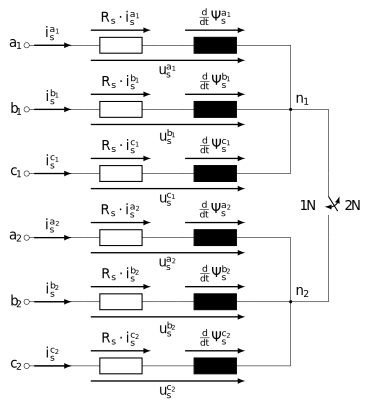

.. _uz_VSD_6ph_FD_control:

========================================================
6 phase VSD open-phase-fault (OPF) detection and control
========================================================

Introduction to six phase machines
==================================

Asymmetric six phase machines, also called dual three-phase machines, consist of six phases arranged in two three-phase winding sets with the phaseses :math:`a_1, b_1, c_1` and :math:`a_2, b_2, c_2` respectively.
The two three-phase systems are shifted against each other by an angle of :math:`\gamma = \pi/6`, resulting in the stator configuration shown in :numref:`statorconfiguration_asym_6ph`. 

.. _statorconfiguration_asym_6ph:

.. figure:: Statoranordnung_asym_6ph_farbig.svg
    :align: center
    :width: 300px

    Statorconfiguration of an asymmetric six phase machine

Different types of machines can be implemented as asymmetric six phase machines, for example asynchronous, permanent-magnet synchronous or synchronous reluctance machines.

As an example a permanent-magnet synchronous motor (PMSM) is considered here, as described in [[#EldeebH]_].
In :numref:`6ph_pmsm_circuit_diagram` the equivalent circuit diagram of the six phase PMSM is shown.
Worth mentioning are the two possible neutral point configurations N1 with all phases connected in a single neutral point and N2 with two neutral points one per three-phase system.

.. _6ph_pmsm_circuit_diagram:

    Equivalent circuit diagram of an asymmetric six-phase PMSM

The voltage equation

.. math::

	\left[\begin{matrix}
		u_\mathrm{s}^{a_1}(t)\\ u_\mathrm{s}^{b_1}(t)\\ u_\mathrm{s}^{c_1}(t)\\ u_\mathrm{s}^{a_2}(t)\\ u_\mathrm{s}^{b_2}(t)\\ u_\mathrm{s}^{c_2}(t)\\
	\end{matrix}\right] = 
	\left[\begin{matrix}
		R_\mathrm{s} & 0 & 0 & 0 & 0 & 0 \\	
		0 & R_\mathrm{s} & 0 & 0 & 0 & 0 \\	
		0 & 0 & R_\mathrm{s} & 0 & 0 & 0 \\	
		0 & 0 & 0 & R_\mathrm{s} & 0 & 0 \\	
		0 & 0 & 0 & 0 & R_\mathrm{s} & 0 \\	
		0 & 0 & 0 & 0 & 0 & R_\mathrm{s} \\	
	\end{matrix}\right] \cdot 
	\left[\begin{matrix}
		i_\mathrm{s}^{a_1}(t)\\ i_\mathrm{s}^{b_1}(t)\\ i_\mathrm{s}^{c_1}(t)\\ i_\mathrm{s}^{a_2}(t)\\ 	i_\mathrm{s}^{b_2}(t)\\ i_\mathrm{s}^{c_2}(t)\\
	\end{matrix}\right] +
	\frac{d}{dt}
	\left[\begin{matrix}
		\Psi_\mathrm{s}^{a_1}(t, \theta_\mathrm{e})\\ \Psi_\mathrm{s}^{b_1}(t, \theta_\mathrm{e})\\ \Psi_\mathrm{s}^{c_1}(t, \theta_\mathrm{e})\\ \Psi_\mathrm{s}^{a_2}(t, \theta_\mathrm{e})\\ \Psi_\mathrm{s}^{b_2}(t, \theta_\mathrm{e})\\ \Psi_\mathrm{s}^{c_2}(t, \theta_\mathrm{e})\\
	\end{matrix}\right]

can be derived from the equivalent circuit. The following short notation can also be used.

.. math::

	\mathbf{u}_\mathrm{s}^{a_1 \rightarrow c_2}(t) = R_\mathrm{s}\mathbf{i}_\mathrm{s}^{a_1 \rightarrow c_2}(t) + \tfrac{d}{dt} \boldsymbol{\Psi}_\mathrm{s}^{a_1 \rightarrow c_2}(\mathbf{i}_\mathrm{s}^{a_1 \rightarrow c_2}(t), \theta_\mathrm{e}(t))

With :math:`\mathbf{f_\mathrm{s}}^{a_1 \rightarrow c_2} = \left( f_\mathrm{s}^{a_1}, f_\mathrm{s}^{b_1}, f_\mathrm{s}^{c_1}, f_\mathrm{s}^{a_2}, f_\mathrm{s}^{b_2}, f_\mathrm{s}^{c_2} \right)  ^T \in \mathbb{R}^6` and the variable :math:`f` representing either the voltage :math:`v` in volt, the current :math:`i` in ampere or the flux linkage :math:`\Psi` in Wb.
:math:`R` represents the resistance of the windings in ohm.
In the following equations the time and angle dependencies are not included for better readability.

For modeling three phase machines the Clarke-transformation is applied.
For multiphase machines like the asymmetric six phase PMSM, a generalized Clarke transformation can be used.
This transformation is called vector space decomposition (VSD).

The VSD Transformation uses the transformation matrix :math:`\mathbf{T}_\mathrm{VSD}`:

.. math::

    \mathbf{T}_\mathrm{VSD} = \frac{1}{3}\left[\begin{matrix}1&-\frac{1}{2}&-\frac{1}{2}&\frac{\sqrt3}{2}&-\frac{\sqrt3}{2}&0\\0&\frac{\sqrt3}{2}&-\frac{\sqrt3}{2}&\frac{1}{2}&\frac{1}{2}&-1\\1&-\frac{1}{2}&-\frac{1}{2}&-\frac{\sqrt3}{2}&\frac{\sqrt3}{2}&0\\0&-\frac{\sqrt3}{2}&\frac{\sqrt3}{2}&\frac{1}{2}&\frac{1}{2}&-1\\1&1&1&0&0&0\\0&0&0&1&1&1\\\end{matrix}\right]

The VSD can be applied to the the phase voltages, currents and flux linkage to decompose the six-phase quantities to three orthogonal planes:

.. math::
    \mathbf{f}_\mathrm{s}^\mathrm{VSD} = \mathbf{T}_\mathrm{VSD} \cdot \mathbf{f}_\mathrm{s}^{a_1 \rightarrow c_2}

.. math::
    [\mathbf{f}_\mathrm{s}^\mathrm{\alpha\beta}, \mathbf{f}_\mathrm{s}^\mathrm{xy}, \mathbf{f}_\mathrm{s}^\mathrm{0^+0^-}]^T = \mathbf{T}_\mathrm{VSD} \cdot \mathbf{f}_\mathrm{s}^{a_1 \rightarrow c_2}

The three planes are the :math:`\alpha\beta`-system, :math:`xy`-system and :math:`0^+0^-`- system with :math:`\mathbf{f}_\mathrm{s}^\mathrm{\alpha\beta} = [f_\mathrm{s}^\mathrm{\alpha}, f_\mathrm{s}^\mathrm{\beta} ]^T`, :math:`\mathbf{f}_\mathrm{s}^\mathrm{xy} = [f_\mathrm{s}^\mathrm{x}, f_\mathrm{s}^\mathrm{y} ]^T` and :math:`\mathbf{f}_\mathrm{s}^\mathrm{0^+0^-} = [f_\mathrm{s}^\mathrm{0^+}, f_\mathrm{s}^\mathrm{0^-} ]^T`.
The :math:`0^+0^-`- system is also called the zero-system, containing zero sequence components from both three-phase subsystems.
The VSD maps different harmonics to different subspaces, such that the :math:`\alpha\beta`-plane holds the :math:`12\lambda\pm1` harmonics for :math:`\lambda \in \{1,2,3,... \}`, the :math:`xy`-plane holds the :math:`6\lambda\pm1` harmonics for :math:`\lambda \in \{1,3,5,... \}` and the :math:`0^+0^-`-plane holds the :math:`3\lambda\pm1` harmonics for :math:`\lambda \in \{1,3,5,... \}`.

In the VSD system a new model of the six phase PMSM can be derived:

.. math::
	\mathbf{u}_\mathrm{s}^{VSD} = R_\mathrm{s}\cdot \mathbf{i}_\mathrm{s}^{VSD} + \tfrac{d}{dt}\boldsymbol{\Psi}_\mathrm{s}^{VSD}

which also can be written in the three independent subsystems:

.. math::
	\mathbf{u}_\mathrm{s}^{\alpha\beta} &= R_\mathrm{s}\cdot \mathbf{i}_\mathrm{s}^{\alpha\beta} + \tfrac{d}{dt}\boldsymbol{\Psi}_\mathrm{s}^{\alpha\beta}

	\mathbf{u}_\mathrm{s}^{xy} &= R_\mathrm{s}\cdot \mathbf{i}_\mathrm{s}^{xy} + \tfrac{d}{dt}\boldsymbol{\Psi}_\mathrm{s}^{xy}

	\mathbf{u}_\mathrm{s}^{0^+0^- } &= R_\mathrm{s}\cdot \mathbf{i}_\mathrm{s}^{0^+0^-} + \tfrac{d}{dt}\boldsymbol{\Psi}_\mathrm{s}^{0^+0^-}

Using the generalized Park transformation with

.. math::
    \mathbf{T}_\mathrm{P}(\theta_\mathrm{e}) = \left[\begin{matrix}
		\cos(\theta_\mathrm{e}) & \sin(\theta_\mathrm{e}) & 0 & 0 & 0 & 0\\
		-\sin(\theta_\mathrm{e}) & \cos(\theta_\mathrm{e}) & 0 & 0 & 0 & 0\\
        0 & 0 & \cos(\theta_\mathrm{e}) & -\sin(\theta_\mathrm{e}) & 0 & 0 \\
        0 & 0 & \sin(\theta_\mathrm{e}) & \cos(\theta_\mathrm{e}) & 0 & 0 \\
        0 & 0 & 0 & 0 & 1 & 0 \\
        0 & 0 & 0 & 0 & 0 & 1 \\
	\end{matrix}\right]

a further transformation into rotating coordinate systems is possible, resulting in the following voltage equations

.. math::
    \begin{split}
	    \mathbf{u}_\mathrm{s}^{dq} &= R_\mathrm{s}\cdot\mathbf{i}_\mathrm{s}^{dq} + \omega_\mathrm{e} \cdot \mathbf{J}_0 \cdot  \boldsymbol{\Psi}_\mathrm{s}^{dq} + \tfrac{d}{dt}\boldsymbol{\Psi}_\mathrm{s}^{dq}\\
        \mathbf{u}_\mathrm{s}^{x'y'} &= R_\mathrm{s} \cdot \mathbf{i}_\mathrm{s}^{x'y'} - \omega_\mathrm{e} \cdot \mathbf{J}_0 \cdot \boldsymbol{\Psi}_\mathrm{s}^{x'y'} + \tfrac{d}{dt}\boldsymbol{\Psi}_\mathrm{s}^{x'y'}\\
        \mathbf{u}_\mathrm{s}^{0^+0^- } &= R_\mathrm{s}\cdot \mathbf{i}_\mathrm{s}^{0^+0^-} + \tfrac{d}{dt}\boldsymbol{\Psi}_\mathrm{s}^{0^+0^-}
    \end{split}

with

.. math::
    \mathbf{J}_0 = \left[\begin{matrix}
		0 & -1\\
		1 & 0\\
	\end{matrix}\right].

:math:`\theta_\mathrm{e}` represents the angular position of the rotor, while :math:`\omega_\mathrm{e}` represents the angular velocity of the rotor.
The :math:`\alpha\beta`-system is thereby transformed into the, with while :math:`\omega_\mathrm{e}` synchronous to the rotor rotating, :math:`dq`-system, the  :math:`xy`-system is transformed into the, with :math:`-\omega_\mathrm{e}` antisynchronous to the rotor rotating, :math:`x'y'`-system, while the :math:`0^+0^-`- system is not transformed into a rotating system.

With these model equations of the six phase PMSM VSD based methods for controlling the machine are possible.

Fault tolerant machines
=======================

One advantage of asymmetric six phase machines over classical three phase machines is their fault tolerance against open phase faults.
This type of machine can continue to operate even in the event of multiple phase failures, while still producing constant torque.
To achieve optimal open phase fault (OPF) tolerance a fault detection and an adaptation of the control by using adjusted reference values according to the fault scenario is necessary.
This module contains a collection of functions for OPF detection and reference value generation for control during OPF in asymmetric six phase machines.

Components
==========

..	toctree::
    :maxdepth: 2
    :glob:
  
    *

.. [#EldeebH] H. Eldeeb, "Modelling, Control and Post-Fault Operation of Dual Three-phase Drives for Airborne Wind Energy," Diss., Technische Universität München, München, 2019