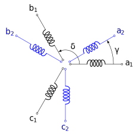

.. _uz_VSD_6ph_FD_control:

========================================================
6 phase VSD open-phase-fault (OPF) detection and control
========================================================

Introduction
============

Asymmetric six phase machines, also called dual three-phase machines, consist of six phases arranged in two three-phase winding sets with the phaseses :math:`a_1, b_1, c_1` and :math:`a_2, b_2, c_2` respectively.
The two three-phase systems are shifted against each other by an angle of :math:`\gamma = \pi/6`, resulting in the stator configuration shown in :numref:`statorconfiguration_asym_6ph`. 

.. _statorconfiguration_asym_6ph:

    Statorconfiguration of an asymmetric six phase machine

One advantage of asymmetric six phase machines over classical three phase machines is their fault tolerance against open phase faults.
This type of machine can continue to operate even in the event of multiple phase failures, while still producing constant torque.
To achieve open phase fault (OPF) tolerance a fault detection and an adaptation of the control by using adjusted reference values according to the fault scenario is necessary.
This module contains a collection of functions for OPF detection and reference value generation for control during OPF in asymmetric six phase machines.

Components
==========

..	toctree::
    :maxdepth: 2
    :glob:
  
    *