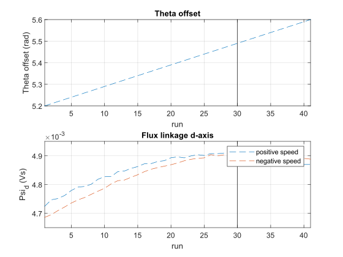

.. _uz_encoder_offset_estimation:

=========================
Encoder Offset Estimation
=========================

Workflow
--------

Estimate Theta with "wrong" method.
Use estimated theta in code below and algorithm will find true theta in that range.

Example Result
--------------

   Measurement Result for 6ph Brose 

Example Code
------------

It is important to use the global data struct at least for the measured theta electric, theta offset, omega electric and u_q

.. code-block:: c
    :caption: main

    #include "uz/uz_encoder_offset_estimation/uz_encoder_offset_estimation.h"
    struct uz_encoder_offset_estimation_config encoder_offset_cfg = {
            .actual = &Global_Data.av,
            .polepair = UZ_D5_MOTOR_POLE_PAIR_NUMBER,
            .setpoint_current = 3.0f
    };
    uz_encoder_offset_estimation_t* encoder_offset_obj = NULL;

    // your own current controller stuff here, e.g.
    #include "uz/uz_Current_Control/uz_Current_Control.h"
    struct uz_PI_Controller_config PI_config = {
        			.Ki = ParaID_Data.GlobalConfig.PMSM_config.R_ph_Ohm/(2.0f*tau_sum),
					.Kp = ParaID_Data.GlobalConfig.PMSM_config.Ld_Henry/(2.0f*tau_sum),
					.samplingTime_sec = isr_ts,
					.lower_limit = -20.0f,
					.upper_limit = 20.0f
        	};
    struct uz_CurrentControl_config cc_config = {
        	        .decoupling_select = no_decoupling,
        	        .config_id = PI_config,
					.config_iq = PI_config,
        	        .config_PMSM = ParaID_Data.GlobalConfig.PMSM_config};
    uz_CurrentControl_t* CC_instance = NULL;

    ..
    // in main loop
    CC_instance = uz_CurrentControl_init(cc_config);
    Global_Data.av.theta_offset = 5.4f; // set inital theta offset, MUST be before init encoder offset object!!
    encoder_offset_obj = uz_encoder_offset_estimation_init(encoder_offset_cfg);
    ..

.. code-block:: c
    :caption: isr

    #include "../uz/uz_EncOffEst/uz_EncOffEst.h"
    extern uz_EncOffEst_t* enc_off;
    float theta = 0.0f;
    uz_3ph_dq_t enc_off_set = {0};
    uz_3ph_dq_t cc_3ph_out = {0};

    // encoder offset
    #include "../uz/uz_encoder_offset_estimation/uz_encoder_offset_estimation.h"
    uz_3ph_dq_t setpoint_current = {0};
    uz_3ph_dq_t ref_voltage_3ph_dq = {0};
    uz_3ph_abc_t ref_voltage_3ph_abc = {0};

    extern uz_encoder_offset_estimation_t* encoder_offset_obj;

    // use current control of choice
    extern uz_CurrentControl_t* CC_instance_1;
    ..
    //in isr loop
    Global_Data.av.U_q = cc_3ph_out.q;
	theta = Global_Data.av.theta_elec - Global_Data.av.theta_offset;
    actual_i_dq = Park(abc_current, theta);

    if (current_state==control_state)
    {
        if(!uz_encoder_offset_estimation_get_finished(encoder_offset_obj)){
            setpoint_current = uz_encoder_offset_estimation_step(encoder_offset_obj);
        }else{
            setpoint_current.d = 0.0f;
            setpoint_current.q = 0.0f;
        }
        ref_voltage_3ph_dq = uz_CurrentControl_sample(CC_instance, setpoint_current, actual_i_dq, actual_UDC, actual_omega_el);
        ref_voltage_3ph_abc = invPark(ref_voltage_3ph_dq, theta);
        //write duty-cycles
        ..
       }