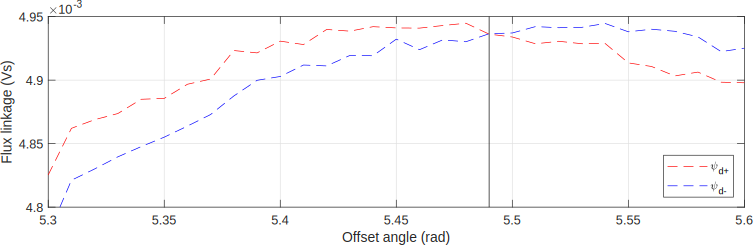

.. _uz_encoder_offset_estimation:

=========================
Encoder Offset Estimation
=========================

General
-------

This software module addresses the challenges with determining encoder offset of PMSMs as described in :ref:`how_to_set_encoder_offset`.
The method according to :ref:`how_to_set_encoder_offset_flux_based_no_machine` is implemented.
This method (:ref:`how_to_set_encoder_offset_flux_based_no_machine`) has proven to deliver significantly better results than the basic method of applying a space vector to phase a (:ref:`how_to_set_encoder_offset_a_phase`).
The results from two different test-benches are listed in the following table.
Herein, the basic and the advanced methods were used ten times.
The medium values show quite similar results.
However, the standard deviation of the advanced method is significantly lower.

.. csv-table:: Measurement results with both methods
   :file: measurements.csv
   :widths: 50 50 50
   :header-rows: 1

Workflow
--------

First, an initial offset angle must be determined to use this function.
The basic method for that is recommended, meaning a space vector is applied to the :math:`\alpha`-axis, and the resulting rotor angle can be used.
Afterward, the code shown below can be implemented.
Using this code, 40 points will be measured around the given initial offset angle.
The final offset angle is saved in the specified ``uz_encoder_offset_estimation_t`` object.

Example Code
------------

It is important to use the global data struct at least for the measured theta electric, theta offset, omega electric and :math:`u_q`.

.. code-block:: c
    :caption: ``main.c``

    // above loop
    #include "uz/uz_encoder_offset_estimation/uz_encoder_offset_estimation.h"
    struct uz_encoder_offset_estimation_config encoder_offset_cfg = {               // config struct
        .ptr_measured_rotor_angle = &Global_Data.av.theta_elec,                     // pointer to the measured electric rotor angle (raw, not offset corrected)
        .ptr_offset_angle = &Global_Data.av.theta_offset,                           // pointer to global variable holding the offset angle
        .ptr_actual_omega_el = &Global_Data.av.omega_el,                            // pointer to actual electric rotor angular speed
        .ptr_actual_u_q_V = &Global_Data.av.U_q,                                    // pointer to q-setpoint voltage
        .min_omega_el = 400.0f,                                                     // target electric rotor angular speed (USE OWN)
        .setpoint_current = 4.0f};                                                  // current setpoint to reach speed (USE OWN)
    uz_encoder_offset_estimation_t* encoder_offset_obj = NULL;                      // object pointer
    ..
    // in loop
    Global_Data.av.theta_offset = 5.4f;                                             // inital offset (USE OWN)
    encoder_offset_obj = uz_encoder_offset_estimation_init(encoder_offset_cfg);     // init function
    ..

.. code-block:: c
    :caption: ``isr.c``

    // aboce loop
    #include "../uz/uz_encoder_offset_estimation/uz_encoder_offset_estimation.h"
    uz_6ph_dq_t transformed_voltage = {0};
    uz_3ph_dq_t setpoint_current = {0};
    uz_3ph_dq_t ref_voltage_3ph;
    float theta_el = 0.0f;
    extern uz_encoder_offset_estimation_t* encoder_offset_obj;
    ..
    //in loop
    Global_Data.av.U_q = cc_3ph_out.q;                                              // write controller output ref voltage to global data
    theta_el = Global_Data.av.theta_elec - Global_Data.av.theta_offset;             // calculate resulting theta
    actual_i_dq = uz_transformation_3ph_abc_to_dq(abc_current, theta_el);           // transform measured abc currents to dq with corrected angle                           

    if (current_state==control_state)                                               // in control state
    {
        if(!uz_encoder_offset_estimation_get_finished(encoder_offset_obj)){         // if not finished
            setpoint_current = uz_encoder_offset_estimation_step(encoder_offset_obj);//receive current controller setpoint current from stepping function
        }else{
            setpoint_current.d = 0.0f;                                              // else: it is finished, setpoints are 0
            setpoint_current.q = 0.0f;
        }

        // control function, use your own
        ref_voltage_3ph = uz_CurrentControl_sample(CC_instance, setpoint_current, actual_i_dq, actual_UDC, actual_omega_el);
        ref_voltage_3ph_abc = invPark(ref_voltage_3ph, theta);
        //write duty-cycles
        ..
       }

Example Result
--------------

The following figure shows what the measurement results look like.
The black line indicates the determined offset angle.
The initial angle was 5.4 rad.

   Measurement Result

Known Problems
--------------

The function will stop if the rotor does not move or reach the necessary speed in time.
The variable ``diagnose`` inside the object pointer will indicate this error with the status ``encoderoffset_speed_not_reached``.
To fix this, increase the setpoint current in the config struct.
Furthermore, even if a voltage measurement is available on the test-bench setup, the results are more reliable when the controller reference voltage is used for calculation.
Therefore it is not recommended to use a measured voltage.