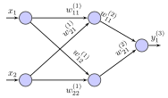
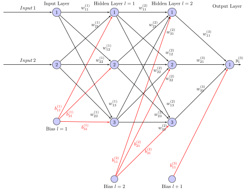
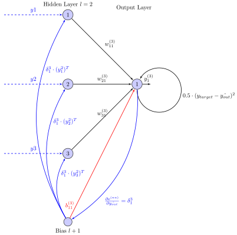

.. _neural_network:

==============
Neural network
==============

The following describes the basic theory and definitions for `multilayer perceptron networks <https://en.wikipedia.org/wiki/Multilayer_perceptron>`_, a class of feedforward neutral networks.
The software module :ref:`uz_nn` is based on the definitions on this page.

Network and dimension definition
================================

A neural network consists of an input layer, one or multiple hidden layer, and an output layer.
Each layer has one or multiple neurons (also called perceptorn or nodes). 
A network with one input layer, one hidden layer and one output layer has :math:`l=2` layers (hidden layer +1, input layer is not counted).
A network can have a different number of inputs and outputs, e.g., two inputs and one output.
Each hidden layer has a defined number of neurons in the layer.

The weight connecting the first input :math:`x_1` to the first neuron of the first hidden layer is called :math:`w^{(1)}_{11}`.
From the first input to the second neuron :math:`w^{(1)}_{12}` and from the second input to the first neuron of the first hidden layer :math:`w^{(1)}_{21}`.
Generalized:

.. math::

   w^{(l)}_{i,j}

The index of the layer :math:`l` is counted by a superscript (:math:`w^{(l)}`).
Therefore, :math:`w^{(1)}` is the complete matrix with all weights of the layer :math:`l=1`.
The row of the weight matrix is defined by the number of connections which end in the layer.
That is, the number of rows (:math:`m`) is equal to the number of inputs in first hidden layer (:math:`w^{(1)}`) and for all other hidden layer (:math:`l>1`) the number of rows (:math:`m`) is equal to the number of neurons of the previous hidden layer (:math:`l-1`).
Each neuron in a hidden layer :math:`l` has one connection to every neuron of the following layer :math:`l+1` (*fully connected*).

The weight matrix has the following generic dimensions:

   Dimensions of weight matrix

For each layer :math:`l` there is a weight and a bias matrix.
The matrix is numbered by the layer :math:`l` of which the weight belongs to (= the layer to which the weight connects to / where the arrow ends).
The first subscript :math:`i` notes the number (counted from up to down in the layer) of the starting neuron (or the input).
The second subscript :math:`j` notes the number of the neuron where the connection ends.

.. _simple_nn_twolayer:

   Simple neural network with naming scheme of weights

The weights and bias of the network in :numref:`simple_nn_twolayer` are represented by the following equations.

.. math::

   w^{(1)}_{ij}=\left[ \begin{array}{rr} w_{11} & w_{12} \\ w_{21} & w_{22} \\ \end{array}\right]

.. math::

   w^{(2)}_{ij}=\left[ \begin{array}{rr} w_{11} \\ w_{21} \\ \end{array}\right]

The bias are not shown but represented as following:

.. math::
   
   b^{(1)}_{j}=\left[ \begin{array}{rr} b_{1} & b_{2} \\ \end{array}\right]

.. math::
   
   b^{(2)}_{j}=\left[ \begin{array}{rr} b_{1}\\ \end{array}\right]

.. note:: The notation across the literature and different other software implementations (e.g., Tensorflow, Pytorch, Matlab) is not consistent. The definition of inputs, weights, and bias can be transposed and the calculation of :math:`s` rearranged (:math:`w^T y` instead of :math:`yw`) without changing the function of the network. Having the inputs as column or row vector is used by differend software modules, see this `article <https://medium.com/from-the-scratch/deep-learning-deep-guide-for-all-your-matrix-dimensions-and-calculations-415012de1568>`_ for example. 

Neurons
=======

.. _nn_neuron_definition:

   First neuron :math:`j=1` of layer :math:`l` with inputs :math:`y^l`, weights :math:`w^l_{i,j}`, bias :math:`b^l_j` and output :math:`y^l_j` (definition according to [#intelligente_verfahren]_)

Neurons are the basic building block of neural networks.
A neuron sums over its weighted input values as well as the bias and calculates the output based on an arbitrary activation function :math:`\mathcal{F}(\cdot)`.
The notation of this software module denotes the number of the layer with the superscript :math:`l` for all parameters.
The weight connecting the output :math:`y^{l-1}_i` of the :math:`i`-th neuron of the previous layer :math:`l-1` with the input of the :math:`j`-th neuron of the layer :math:`l` is denoted by :math:`w^l_{i,j}`.
The following equation calculates the dot product of the weight vector :math:`\boldsymbol{w}^l_j` and the input vector :math:`\boldsymbol{y}^l_j` of the :math:`j`th neuron of layer :math:`l` with the length :math:`n` and adds the bias :math:`b^l_j` to yield the sum :math:`s^l_j` of the neuron inputs.

.. math::

   s^l_j =\sum^n_{i=1} y^{l-1}_{ij} w^l_{ij} + b^l_j

The output value :math:`y^l_j` of the neuron is calculated by the activation function for all hidden layers.

.. math::

   y^l_j = \mathcal{F}(s^l_j)

Network example
===============

MLP are implemented with the following definition and representation of the neural network.
The neural network has a number of layers which consists of the input layer, the output layer, and the number of hidden layer :math:`l`).
Each layer has a number of neurons.

Feedforward example
********************

.. _nn_structure:

   Structure of a neural network

The MLP shown in :numref:`nn_structure` has two inputs, two hidden layer with three neurons each, and one output.
The input is defined as:

.. math::

    x &=y^{(0)}=\left[ \begin{array}{rr} x_{1} & x_{2} \\ \end{array}\right] \\
    x &=y^{(0)}=\left[ \begin{array}{rr} 1 & 2 \\ \end{array}\right] 

The output is defined as:

.. math::

    y^{(3)}=\left[ \begin{array}{rr} y_{1} \\ \end{array}\right]

The weights and bias matrices for each layer with example values are given n the following.
For the first hidden layer:

.. math::

   w^{(1)} &=\left[ \begin{array}{rr} w_{11} & w_{12} &  w_{13} \\ w_{21} & w_{22} & w_{23} \\ \end{array}\right] \\
   w^{(1)} &=\left[ \begin{array}{rr} 0.8 &	0.1 &	0.6\\0.9	& 0.9 &0.1\\ \end{array}\right] \\
   b^{(1)} &=\left[ \begin{array}{rr} b_1 & b_2 &  b_3 \\ \end{array}\right] \\
   b^{(1)} &=\left[ \begin{array}{rr} 0.8 & 1 & 0.7 \\ \end{array}\right]

For the second hidden layer:

.. math::

   w^{(2)} &=\left[ \begin{array}{rr} w_{11} & w_{12} &  w_{13} \\ w_{21} & w_{22} & w_{23} \\ w_{31} & w_{32} & w_{33} \end{array}\right] \\
   w^{(2)} &=\left[ \begin{array}{rr} 0.3 & 1 &	1\\0.5 &	0.2 & 0.5\\ 1 & 1	& 0.8\\ \end{array}\right] \\
   b^{(2)} &=\left[ \begin{array}{rr} b_1 & b_2 &  b_3 \\ \end{array}\right] \\
   b^{(2)} &=\left[ \begin{array}{rr} 0 & 0.8 &	0.9\\ \end{array}\right]

For the output layer:

.. math::

   w^{(3)} &=\left[ \begin{array}{rr} w_{11} \\ w_{21} \\ w_{31} \end{array}\right] \\
   w^{(3)} &=\left[ \begin{array}{rr}0.1 \\0.4 \\ 0.9\end{array}\right] \\
   b^{(3)} &=\left[ \begin{array}{rr} b_1 \\ \end{array}\right] \\
   b^{(3)} &=\left[ \begin{array}{rr} 0.7 \\ \end{array}\right]

The activation function of the hidden layer is set to ReLU, the output activation function to linear.
In this example all weights and bias are iniitalized between 0 and 1. This is one common way of weight initalization, see `python weight initalization <https://stackoverflow.com/questions/49433936/how-do-i-initialize-weights-in-pytorch>`_ for more input.
The following section calculates all steps and intermediate results in the network.

First layer
***********

.. math::

   \boldsymbol{x} \boldsymbol{w^{(1)}} + \boldsymbol{b^{(1)}} &= \boldsymbol{s^{(1)}} \\  
   \left[ \begin{array}{rr} 1 & 2 \\ \end{array}\right]
   \left[ \begin{array}{rr} 0.8 &	0.1 &	0.6\\0.9	& 0.9 &0.1\\ \end{array}\right]  
   +
   \left[ \begin{array}{rr} 0.8 & 1 & 0.7 \\ \end{array}\right]
   &= 
   \left[ \begin{array}{rr} 3.4 & 2.9 & 1.5\\ \end{array}\right]

Activation function:

.. math::

      y^{1} &= ReLU(\boldsymbol{s^{(1)}}) \\
      y^{1} &= ReLU(   \left[ \begin{array}{rr} 3.4 & 2.9 & 1.5\\ \end{array}\right])\\
      &=  \left[ \begin{array}{rr} 3.4 & 2.9 & 1.5 \\ \end{array}\right]

Second layer
************

The input of the second hidden layer is the output of the first hidden layer :math:`y^{(1)}`:

.. math::

   \boldsymbol{y^{(1)}} \boldsymbol{w^{(2)}} + \boldsymbol{b^{(2)}} &= \boldsymbol{s^{(2)}} \\  
   \left[ \begin{array}{rr} 3.4 & 2.9 & 1.5 \\ \end{array}\right]
   \left[ \begin{array}{rr} 0.3 & 1 &	1\\0.5 &	0.2 & 0.5\\ 1 & 1	& 0.8\\ \end{array}\right] 
   +
   \left[ \begin{array}{rr} 0 & 0.8 &	0.9\\ \end{array}\right]\\
   &= 
   \left[ \begin{array}{rr} 3.97 & 6.28 & 6.95\ \end{array}\right]

Activation function:

.. math::

      y^{2} &= ReLU(\boldsymbol{s^{(2)}}) \\
      y^{2} &= ReLU(   \left[ \begin{array}{rr}3.97 & 6.28 & 6.95\\ \end{array}\right])\\
      &=  \left[ \begin{array}{rr}3.97 & 6.28 & 6.95\\ \end{array}\right]

Output layer
************

The input of the output layer is the output of the second hidden layer :math:`y^{(2)}`:

.. math::

   \boldsymbol{y^{(2)}} \boldsymbol{w^{(3)}} + \boldsymbol{b^{(3)}} &= \boldsymbol{s^{(3)}} \\  
   \left[ \begin{array}{rr} 3.97 & 6.28 & 6.95\\ \end{array}\right]
   \left[ \begin{array}{rr}0.1 \\0.4 \\ 0.9\end{array}\right]
   +
   \left[ \begin{array}{rr} 0.7 \\ \end{array}\right]
   &= \left[ \begin{array}{rr} 9.864 \\ \end{array}\right]

Activation function:

.. math::

      y^{3} &= linear(\boldsymbol{s^{(3)}}) \\
      y^{3} &= linear(   \left[ \begin{array}{rr} 9.864 \\ \end{array}\right])\\
      &=  \left[ \begin{array}{rr} 9.864 \\ \end{array}\right]

This example until here shows the feedforward calculation of any pretrained or untrained network. The next section covers the training of an neural network on the ARM-Processor on the UltraZohm.

Training example with Backpropagation
**************************************

Backpropagation
****************

For the training of a neural network, the error or the loss must be known. There are different types or possibilities for evaluating this loss function. 
In this example the target output is known and notated as :math:`Y_i` or :math:`y_{target}`.

Step 1: Calculate Error
************************

The error is evaluated in the output layer with the loss or so-named cost function.
The mean squared error loss function is the common used function for neural networks.

.. math::

      MSE = \frac{1}{n}\sum_{i=1}^{n}(Y_i - \hat{Y_i})^2

In this example, the target output is defined as :math:`2`.

.. math::

    y^{(target)}=\left[ \begin{array}{rr} 2 \\ \end{array}\right]

This leads to an error of the output layer with respect to the MSE loss function:

.. math::

      \hat{y_{out}}= & y^{3} =( \left[ \begin{array}{rr} 9.864 \\ \end{array}\right])\\
      e^{(nn)}= 0.5 \cdot (y_{target}- \hat{y_{out}})^2 &= 0.5 \cdot (2 - 9.864)^2
      &= 
      30.9213 \\

This evaluates the loss for the first training epoch. With this loss and the backpropagation algorithm, the gradietns of the learnable parameters of the network can be calculated.

Step 2: Delta Rule
************************

With the delta rule the local gradient of the output layer can be calculated. This is also the start value of the backpropagation rule. For the calcuation, the derivate of the activation function needs to be calculated.
For an linear output layer, the derivate of the activation function is :math:`1`:

.. math::

      \dot{\mathcal{F}}(s_{1}^{3}) &= 1 \text{ (output neuron has linear transfer function)} \\

Output layer
************

For the output layer, the derivate of the total error with respect to the output have to be determinded. For the derivate of the MSE loss function the term for the error
simplifies for just one output to:

.. math::

   \frac{\partial e^{(nn)}}{\partial \hat{y_{out}}} &= 
   2 \cdot 0.5 \cdot (y_{target}- \hat{y_{out}})^{2-1} \cdot -1 &= -(y_{target}- \hat{y_{out}}) &= \hat{y_{out}}- y_{target}
   &= 7.864 = \delta_{1}^{3}\\

With the local gradient of the output layer, the gradients of all hidden layer can be calculated:

.. math::

   \delta_{p}^{l} &= -\dot{\mathcal{F}}^{l}(s_{p}^{l})({w}^{l+1})^{\mathcal{F}}\delta_{p}^{l+1} \\

For the second and first hidden layer this results in :

.. math::

      \dot{\mathcal{F}}(s_{1}^{2}) &=\left[ \begin{array}{rr} F'(s_{1}^{2})& 0 & 0\\ 0 & F'(s_{2}^{2}) & 0\\ 0 &0 & F'(s_{3}^{2})\end{array}\right] \\
      \dot{\mathcal{F}}(s_{1}^{1}) &=\left[ \begin{array}{rr} F'(s_{1}^{1})& 0 & 0 \\ 0 & F'(s_{2}^{1}) & 0\\0 &0 & F'(s_{3}^{1})\end{array}\right] \\

.. math:: 

   l=2:\delta_{1}^{2} &= \dot{\mathcal{F}}(s_{1}^{2}) \cdot {w^{3}}^{T} \cdot \delta_{1}^{3}\\
    =&
   \left[ \begin{array}{rr} 1 &0 &0 \\0 & 1 & 0 \\ 0&0&1 \end{array}\right]
   \cdot
   \left[ \begin{array}{rr}0.1&0.4& 0.9\end{array}\right]
   \cdot -7.864 
   &= 
   \left[ \begin{array}{rr}0.7864\\3.1456\\7.0776 \end{array}\right]

.. math::

   l=1:\delta_{1}^{1} &= \dot{\mathcal{F}}(s_{1}^{1}) \cdot {w^{2}}^{T} \cdot \delta_{1}^{2}\\  
    =&
  \left[ \begin{array}{rr} 1 &0 &0 \\0 & 1 & 0 \\ 0&0&1 \end{array}\right]
   \cdot
   \left[ \begin{array}{rr} 0.3 & 0.5 & 1\\ 1 &	0.2 & 1\\1 & 0.5	& 0.8\\ \end{array}\right] 
   \cdot
   \left[ \begin{array}{rr} 0.7864\\3.1456\\7.0776 \end{array}\right]
   &= 
   \left[ \begin{array}{rr} 10.459 \\ 4.561 \\ 9.594\end{array}\right]

Step 3: Calculate Gradients
****************************

The calculation of the local gradients need to be done to get the gradient from the weights and bias. For the weights, the gradient results in 
the product of the local gradient with the output of the previous layer.

.. _nn_structure_backprop:

So the weight gradients of the example network are.

.. math::

 l=1: \frac{\partial E_{1}}{\partial {w}^{1}} = \delta_{1}^{1} \cdot (y_1^{(0)})^{T} &=\left[ \begin{array}{rr} 10.459 \\ 4.561 \\ 9.594\end{array}\right]\cdot \left[ \begin{array}{rr} 1 \\ 2 \\ \end{array}\right] &= \left[ \begin{array}{rr} 10.459& 20.918\\4.561&9.122\\9.594&19.188\end{array}\right]\\
 l=2: \frac{\partial E_{1}}{\partial {w}^{2}} = \delta_{1}^{2} \cdot (y_1^{(1)})^{T} &=\left[ \begin{array}{rr}0.7864\\3.1456\\7.0776 \end{array}\right]\cdot \left[ \begin{array}{rr} 3.4 \\ 2.9 \\ 1.5 \\ \end{array}\right]&=\left[ \begin{array}{rr} 2.674 & 2.280& 1.1796&\\ 10.695 & 9.122 & 4.718\\ 24.064 & 20.525&10.616\end{array}\right]\\
 l=3: \frac{\partial E_{1}}{\partial {w}^{3}} = \delta_{1}^{3} \cdot (y_1^{(2)})^{T} &= 7.864 \cdot \left[ \begin{array}{rr}3.97\\ 6.28 \\ 6.95\\ \end{array}\right] &= \left[ \begin{array}{rr} 31.220 & 49.386 & 54.655\\ \end{array}\right]\\\\

The bias gradients are the local gradients.

.. math::

 l=1: \frac{\partial E_{1}}{\partial {b}^{1}} = \delta_{1}^{1} &= \left[ \begin{array}{rr} 10.459 \\ 4.561 \\ 9.594\end{array}\right]\\
 l=2: \frac{\partial E_{1}}{\partial {b}^{2}} = \delta_{1}^{2} &= \left[ \begin{array}{rr}0.7864\\3.1456\\7.0776 \end{array}\right]\\
 l=3: \frac{\partial E_{1}}{\partial {b}^{3}} = \delta_{1}^{3} &= 7.864\\

Step 4: Gradient Descent Step
******************************

The previous calculated gradients are used for updating the learnable parameters of the network. There are different methods possible for updating the weights. The basic method is the
gradient descent method, where the parameters are updated in negative gradient direction with a fixed step size. This step size is called the learnrate :math:`\eta`. For calculating more than one trainingsdataset, the minibatch method is used.
Therefore the gradients are stochastically estimated. From an big dataset of size :math:`M`, just a part from it is used to compute the loss function and to calculate the gradients. :math:`N` denotes the minibatch size.
The update formula for gradient descent with minibatch is as follows:

.. math::

 W \rightarrow W^{'} = W - \eta \cdot \frac{1}{N} \cdot \sum_{n = 0}^{N-1} \frac{\partial C_x(x^n)}{\partial W} \\
 b \rightarrow b^{'} = b - \eta \cdot \frac{1}{N} \cdot \sum_{n = 0}^{N-1} \frac{\partial C_x(x^n)}{\partial b} \\

In this example, the minibatch size is 1, so the weights and bias the new parameters with a learnrate :math:`\eta = 0.001` and the calculated gradients are:

.. math::

 w^{(3')}_{11} &=  w^{(3)}_{11}  - \eta \cdot gw^{(3)}_{11} &= 0.1 \cdot - 0.0001 \cdot 31.220 &= 0.0969 \\
 w^{(3')}_{21} &=  w^{(3)}_{21}  - \eta \cdot gw^{(3)}_{21} &= 0.4 \cdot - 0.0001 \cdot 49.386 &= 0.3951 \\
 w^{(3')}_{31} &=  w^{(3)}_{31}  - \eta \cdot gw^{(3)}_{31} &= 0.9  \cdot- 0.0001 \cdot 54.655 &= 0.8945 \\
 b^{(3')} &=  b^{(3)} - \eta \cdot gb^{(3)} &= 0.87 - 0.0001 \cdot 7.864 &= 0.6992 \\

The update process is the same for the other layers.

.. _comparison_ultrazohm_backprop:

.. tikz:: Result of the training of the example dataset with 500 Episodes and a learning rate :math:`\alpha = 0.0001`
   :include: img/MSE_UZ_Matlab_backprop.tex
   :align: center
   :xscale: 100

Minibatch implementation
*************************

For the minibatch implementation, the example dataset `bodyfat <https://de.mathworks.com/help/deeplearning/ug/train-and-apply-multilayer-neural-networks.html>`_ ,from matlab is used. 
The advantage over the previous example is the correlation between input and output data, so the training example with Backpropagation $. 

.. _comparison_matlab_c:

.. tikz:: Result of the training of the example dataset with 200 Episodes and a learning rate :math:`\alpha = 0.001`
   :include: img/MSE_C_Matlab.tex
   :align: center
   :xscale: 100

The plot in  :numref:`comparison_matlab_c` shows the training from the network on the UltraZohm in blue and the reference comparison in matlab. 
With the given Minibatchsize 252, the network calculates the mean-squared error and the gradients for each trainings element, and sums it up.
The accumulated gradients are than used for the update and divided with respect to the minibatch size :math:`\eta \cdot \frac{1}{N}= 0.001 \cdot \frac{1}{252}` for this network.

Sources
=======

.. [#intelligente_verfahren] Schröder, Dierk, "Intelligente Verfahren", Springer, 2010.
.. [#realTimeInference] T. Schindler and A. Dietz, "Real-Time Inference of Neural Networks on FPGAs for Motor Control Applications," 2020 10th International Electric Drives Production Conference (EDPC), 2020, pp. 1-6, doi: 10.1109/EDPC51184.2020.9388185.

Software implementation
=======================

..	toctree::
    :maxdepth: 2
    :hidden:
    :glob:

    uz_nn
    uz_nn_layer
    activation_function
    uz_nn_ip_core