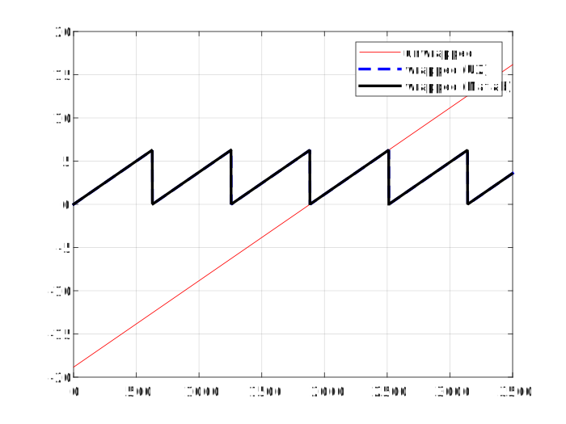

===================
Wrap angle function
===================

.. doxygenfunction:: uz_signals_wrap

Example
=======

.. code-block:: c
  :linenos:
  :caption: Example function call wrap an angle to the range of 0 to :math:`2\pi`

  #include "uz_signals.h"
  int main(void) {
     theta = 13.0f;
     float theta_wrapped = uz_signals_wrap(theta, 2.0f*UZ_PIf);
  }

Use-case
========

This function limits values (e.g., angles) to :math:`[0, 2\pi]`.
The intended use case is for the electric rotor angle of a machine, which is usually a mechanic angle multiplied by the pole pairs.

    Example wrapping to :math:`[0, 2\pi]`

Description
===========

Wraps the input number to the range of :math:`[0, limit]` by using the ``remainderf`` function.
Therefore, technically other upper limits than :math:`2\pi` can be used if desired.
Only limits greater than 0 are allowed!

.. hint:: If a lower limit other than 0 is needed, e.g., as :math:`[-\pi, \pi]`, apply :math:`[0, limit]` as limit and subtract :math:`\pi` afterward.

Calculation
===========

If the number is already in the range, it will be unchanged.
If it is not in the range, ``remainderf`` will be applied.
If the result is positive, it is in the range and will be returned.
Otherwise, the limit is added to the remainder and returned.

