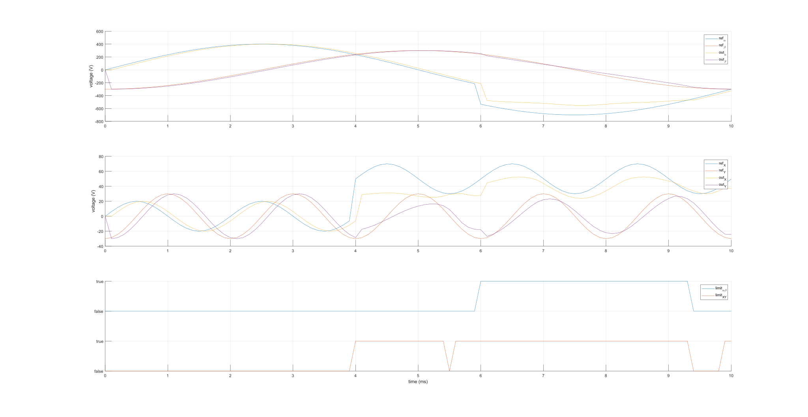
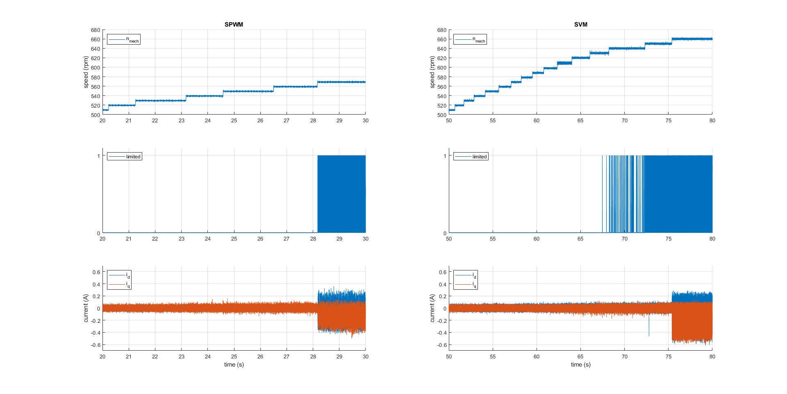

.. _uz_svm_6ph:

===========================
Space vector Modulation 6ph
===========================

.. _uz_svm_6ph_general:

General
=======

.. note:: 

    This module implements a space vector modulation for asymmetrical six-phase machine with isolated neutral points (2N).
    The implementation is adaptable to 1N and described in the references.

SVM for multi-phase works similar to :ref:`uz_spacevectormodulation`.
However, in a multi-phase network, more switching combinations are available (for six-phase :math:`2^6=64`).
Furthermore, switching combination has simultaniously one space vector (SV) in the :math:`\alpha\beta`- and one in the :math:`XY`-subspace.
During the calculations, both have to be taken account of and it has to be noted, that a combination with a large SV (high absolute value) in :math:`\alpha\beta` means usually a small SV in :math:`XY`.
Since an online choosing of SV is not feasible, a preselection from all possible SVs was done and 24 sequences of five active switching combinations is used. [[#Eldeeb_diss]_]

.. figure:: svms_6ph.png
    :align: center
    :width: 1500px

    Selected actives witching combinations in :math:`\alpha\beta` (left) and :math:`XY` (right) with highlighting for sector 1 (Fig.~2[[#Eldeeb_paper]_])

.. _uz_svm_6ph_usage:

Usage
=====

Function references
-------------------

.. doxygenstruct:: uz_svm_asym_6ph_CSVPWM24_out
  :members:

.. doxygenfunction:: uz_Space_Vector_Modulation_asym_6ph_CSVPWM24_alphabeta

.. doxygenfunction:: uz_Space_Vector_Modulation_asym_6ph_CSVPWM24_dq

Minimum code example
--------------------

A minimal code example is given in the following.
The SVM not only calculates Duty Cycles, it also yields phase shifts for the PWM IP-Cores.
Applying them to the modules is vital.
Additionally, the output struct contains two flags, indicating that either the :math:`\alpha\beta`- or :math:`XY`-setpoints or both have been limited.
They can be used for a clamping feature, inhibiting integrators in the control algorithm to overflow.
In this example, they are not used.

.. code-block:: c
  :caption: Changes in ``isr.c`` (R5)

  // declarations
  #include "../uz/uz_Space_Vector_Modulation_6ph/uz_Space_Vector_Modulation_6ph.h"
  uz_6ph_dq_t v_ref_6ph = {0};
  uz_3ph_dq_t v_ref_3ph = {0};
  uz_3ph_dq_t cc_setpoint = {0};
  struct uz_svm_asym_6ph_CSVPWM24_out svm_out = {0};
  ...
  // in isr
  if (current_state==control_state)
  {
    // example current control
    v_ref_3ph = uz_CurrentControl_sample(Global_Data.objects.CC_dq_instance, cc_setpoint, Global_Data.av.actual_3ph_dq, Global_Data.av.v_dc1, Global_Data.av.omega_elec);
    v_ref_6ph.d = v_ref_3ph.d;
    v_ref_6ph.q = v_ref_3ph.q;
    // Modulation
    svm_out = uz_Space_Vector_Modulation_asym_6ph_CSVPWM24_dq(v_ref_6ph, Global_Data.av.theta_elec, Global_Data.av.v_dc1);
  }
  // PWM phase shift
  uz_PWM_SS_2L_set_triangle_shift(Global_Data.objects.pwm_d1_pin_0_to_5, svm_out.shift_system1, svm_out.shift_system1, svm_out.shift_system1);
  uz_PWM_SS_2L_set_triangle_shift(Global_Data.objects.pwm_d1_pin_6_to_11, svm_out.shift_system2, svm_out.shift_system2, svm_out.shift_system2);
  // assign Duty Cycles
  uz_PWM_SS_2L_set_duty_cycle(Global_Data.objects.pwm_d1_pin_0_to_5, svm_out.Duty_Cycle.system1.DutyCycle_A, svm_out.Duty_Cycle.system1.DutyCycle_B, svm_out.Duty_Cycle.system1.DutyCycle_C);
  uz_PWM_SS_2L_set_duty_cycle(Global_Data.objects.pwm_d1_pin_6_to_11, svm_out.Duty_Cycle.system2.DutyCycle_A, svm_out.Duty_Cycle.system2.DutyCycle_B, svm_out.Duty_Cycle.system2.DutyCycle_C);

.. _uz_svm_6ph_details:

Theoretical details
===================

Limitation
----------

The 6ph SVM uses two setpoint limitations.
Both of them limit the absolute value (length) of the SV, while leaving the phase angle untouched.
The checks for the limitations are executed in the listed order below:

The :math:`XY`-SV must not be longer than 10% of the :math:`\alpha\beta`-SV.
As can be seen from (Fig. 3.3[[#Eldeeb_diss]_]), a large :math:`\alpha\beta`-SV represents a small :math:`XY`-SV and vice versa.
Therefore, if the :math:`\alpha\beta`-SV is near the maximum, the :math:`XY`-SV can only be small.
Although a general limitation can not achieve maximum usage in all operating points, with this rule an overall good performance can be expected.

Since the maximum voltage is given by the DC-Bus-Voltage and the modulation index :math:`m_i=\frac{1}{\sqrt{3}}` (determined in simulation), the combined length of the space vectors has to be limited.
Therefore, both lengths are added and if they exceed the maximum allowed voltage, they will be shortened in their existing relations, meaning :math:`\frac{|SV_{\alpha\beta\textrm{, old}|}{|SV_\textrm{XY, old}|}=\frac{|SV_{\alpha\beta\textrm{, limited}|}{|SV_\textrm{XY, limited}|}`.
Since the :math:`XY`-SV limitation is executed before and the relation of the :math:`\alpha\beta`-SV and :math:`XY`-SV are kept the same, the previous limitation will not be violated.

Space vectors
-------------

From the existing :math:`2^6` SVs in a six-phase system, not all of them are used.
Instead, the selected sequences of (Tab. 3.III[[#Eldeeb_diss]_]) are used.
Please note that the decimal notation of [[#Eldeeb_paper]_] and [[#other_paper]_] are used.
Therefore, the binary values of [[#Eldeeb_diss]_] must be mirrored, making the switch a1 being represented by the LSB and c2 by the MSB.

.. csv-table:: Sequences
   :file: sequences_6ph.csv
   :widths: 10 50
   :header-rows: 1

Offline calculations
--------------------

The computation of the Dwell times is done with the voltage references and the inverse matrix of the subsystem components of each SV, as shown in the following equation: [[#Eldeeb_diss]_]

.. math::

  \left[\begin{matrix} u_{\alpha\textrm{, ref}} \\ u_{\beta\textrm{, ref}} \\ u_{\textrm{X, ref}} \\ u_{\textrm{Y, ref}} \\ 1 \\ 
  \end{matrix}\right] = \left[\begin{matrix}
  u^\alpha_\textrm{V1} & u^\alpha_\textrm{V2} & u^\alpha_\textrm{V3} & u^\alpha_\textrm{V4} & 0 \\
  u^\beta_\textrm{V1} & u^\beta_\textrm{V2} & u^\beta_\textrm{V3} & u^\beta_\textrm{V4} & 0 \\ 
  u^\textrm{X}_\textrm{V1} & u^\textrm{X}_\textrm{V2} & u^\textrm{X}_\textrm{V3} & u^\textrm{X}_\textrm{V4} & 0 \\ 
  u^\textrm{Y}_\textrm{V1} & u^\textrm{Y}_\textrm{V2} & u^\textrm{Y}_\textrm{V3} & u^\textrm{Y}_\textrm{V4} & 0 \\ 
  1&1&1&1&1\\
  \end{matrix}\right] \cdot 
  \left[\begin{matrix}
  t_\textrm{V1} \\ t_\textrm{V2} \\ t_\textrm{V3} \\ t_\textrm{V4} \\ t_\textrm{V0} \\
  \end{matrix}\right]

Solving the equation for the Dwell times yields: [[#Eldeeb_diss]_]

.. math::

  \left[\begin{matrix}
  t_\textrm{V1} \\ t_\textrm{V2} \\ t_\textrm{V3} \\ t_\textrm{V4} \\ t_\textrm{V0} 
  \end{matrix}\right] = [T_\textrm{tv}]^{-1}
  \left[\begin{matrix}
  u_{\alpha\textrm{, ref}} \\ u_{\beta\textrm{, ref}} \\ u_{\textrm{X, ref}} \\ u_{\textrm{Y, ref}} \\ 1
  \end{matrix}\right] T_\textrm{sw}

To avoid intensive calculations at runtime, the matrix :math:`[T_\textrm{tv}]^{-1}` can be precalculated for each sector and stored in the ``uz_Space_Vector_Modulation_6ph.c`` file as ``static const float inverse_T_tv_all[24][5][5]``.
Later in the calculation, Duty Cycles must be computed with the Dwell times, requiring a specific assignment order for each sector to the respective phase.
In the same way, they are precalculated and stored as ``static const int svm_offline_order[24][6]``.

The calculations were done in Matlab and all necessary scripts are attached in ``svm_multiphase_matlab.zip`` in the directory of this docs page.

.. _uz_svm_6ph_verification:

Verification
============

Limitation
----------

To test the limitation, a list of :math:`\alpha\beta`-SVs and :math:`XY`-SVs was created with :math:`k \cdot e^{i \cdot \phi}` and :math:`k=0, 0.001, ... 1` und :math:`\phi=0, 0.001, ... 2\pi`.
Each :math:`\alpha\beta`-SV was combined with each :math:`XY`-SV and applied to the SVM.
Using no limitation, the SVM threw an error for a Duty Cycle out of range (negative or greater 1).
Using the limitation, no error occured and the relative limit of :math:`XY`-SV to :math:`\alpha\beta`-SV could even be raised up to 50% without causing an invalid Duty Cycle.

Open loop simulation
--------------------

To verify the SVM in open loop simulation, setpoint voltages for :math:`\alpha\beta` and :math:`XY` to the SVM.
The resulting Duty Cycles were fed into the PWM-IP-Core Simulink model and connected to Simscape VSI-models with :math:`V_\textrm{DC}=1000\textrm{ V}` and a resistive six-phase load with 2N.

Setpoints and measured output voltages are shown in the following figure for both subspaces.
In the last row, the limit flags for both subspaces are shown.

    Open loop simulation

Closed loop testbench
---------------------

On the testbench, a comparison between SPWM and SVM was conducted.
For this test, an asymmetrical six-phase PMSM (:math:`\Psi_\textrm{PM}=0.0047\textrm{ Vs}`) was operated with 2N and :math:`V_\textrm{DC}=3\textrm{ V}`.
The machine is externally driven and the speed, starting at :math:`n_\textrm{mech}=500 \frac{1}{\textrm{min}}` was increased in increments of :math:`10\frac{1}{\textrm{min}}`.
Current controllers in :math:`dq` are set to zero, no other controls are active.

In the resulting figure (see below), a limit flag can be seen.
For SPWM this flag is the current controllers external clamping flag.
It occurs at :math:`n_\textrm{mech}=570\frac{1}{\textrm{min}}` and is accompanied by the currents that can no longer be controlled to zero.

For SVM the ``limited_alphabeta`` flag of the output struct is used.
Since it has a small tolerance (2.5%), it is high at :math:`n_\textrm{mech}=630\frac{1}{\textrm{min}}`, whereas the currents are still at zero.
Only at :math:`n_\textrm{mech}=660\frac{1}{\textrm{min}}` the current controllers cannot keep the currents to zero anymore.

This is also the expected behavior, as the reachable speed with SVM should be :math:`n_\textrm{mech,SVM}=n_\textrm{mech,SPWM} \cdot\frac{2}{\sqrt{3}}\approx 660\frac{1}{\textrm{min}}`.

    Testbench comparison of SPWM and SVM

.. _uz_svm_6ph_literature:

Literature
==========

.. [#Eldeeb_diss] H. Eldeeb, "Modelling, Control and Post-Fault Operation of Dual Three-phase Drives for Airborne Wind Energy," Diss., Technische Universität München, München, 2019
.. [#Eldeeb_paper] H. Eldeeb, C. Hackl, M. Abdelrahem and A. S. Abdel-Khalik, "A unified SVPWM realization for minimizing circulating currents of dual three phase machines," 2017 IEEE 12th International Conference on Power Electronics and Drive Systems (PEDS), Honolulu, HI, USA, 2017, pp. 925-931, doi: 10.1109/PEDS.2017.8289127.
.. [#other_paper] C. Wang, K. Wang, and X. You, “Research on synchronized svpwm strategies under low switching frequency for six-phase vsi-fed asymmetrical dual stator induction machine,” IEEE Trans. on Ind. Electron., vol. 63, no. 11, pp. 6767–6776, Nov. 2016