==================
Create new Project
==================

.. note:: In the UltraZohm software, ``vitis_generate_UltraZohm_workspace.tcl`` takes care of this, see :ref:`tcl_scripts` for more information. 

`Here <https://www.hackster.io/news/microzed-chronicles-getting-up-and-running-with-vitis-8f05eb013289>`_ you can find a nice tutorial on how
to get started with Vitis.

Workspace configuration
-----------------------
1. Export the hardware file

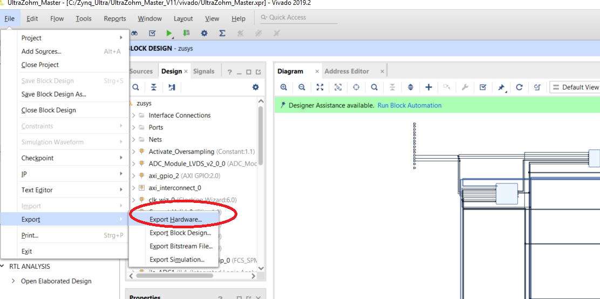
	
2. Define the Vitis workspace
	
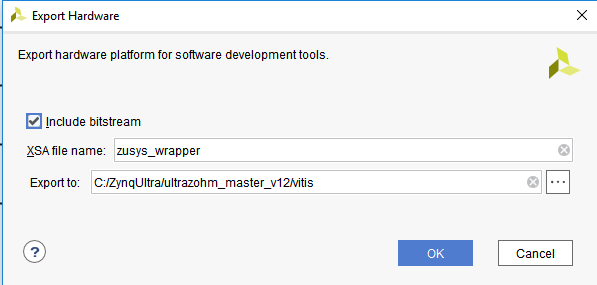
	
3. Afterwards a file "zusys_wrapper.xsa" will be created which describes the hardware description on the FPGA and includes the Bitstream (in older versions/before vitis/with SDK, this was called "zusys_wrapper.hdf")
	
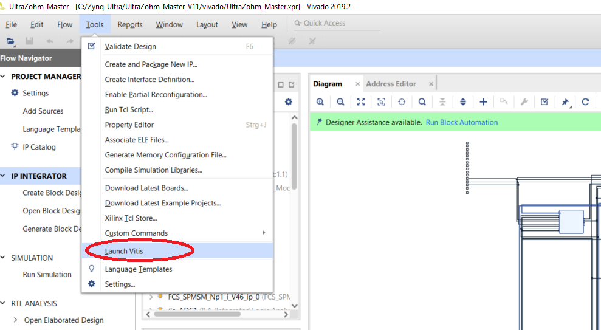

4. Afterwards we can start Vitis, which was in former days the SDK

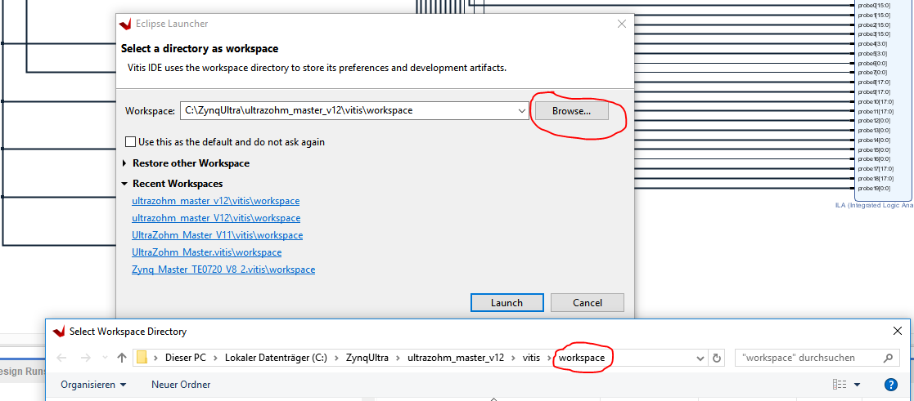

	

The Platform Project
--------------------

1. Create a "Platform Project"

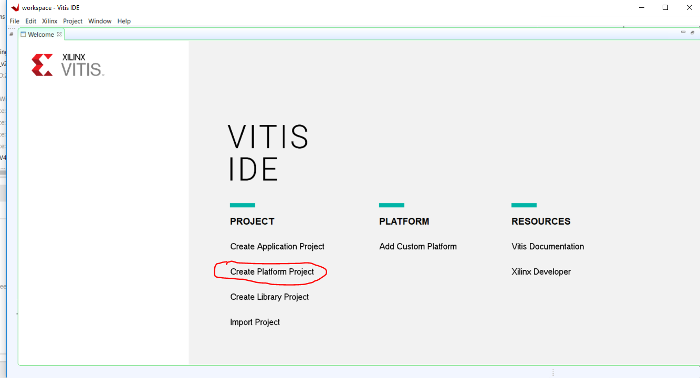
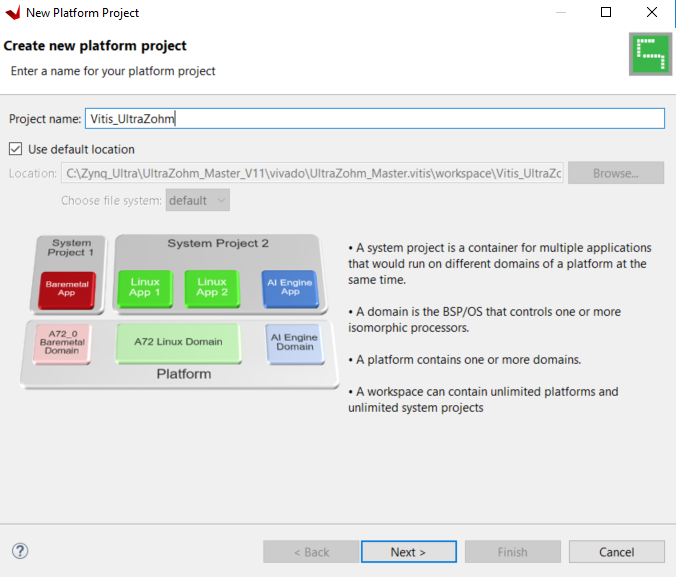
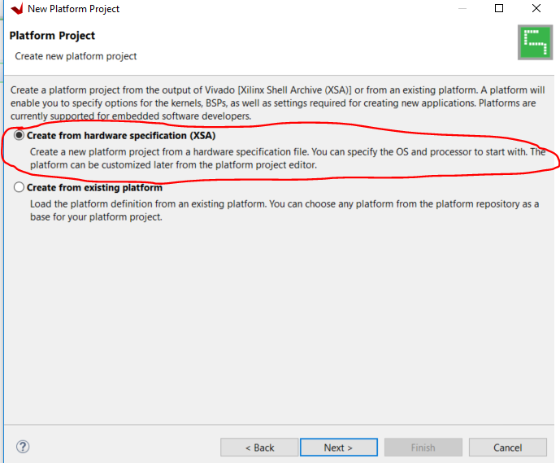
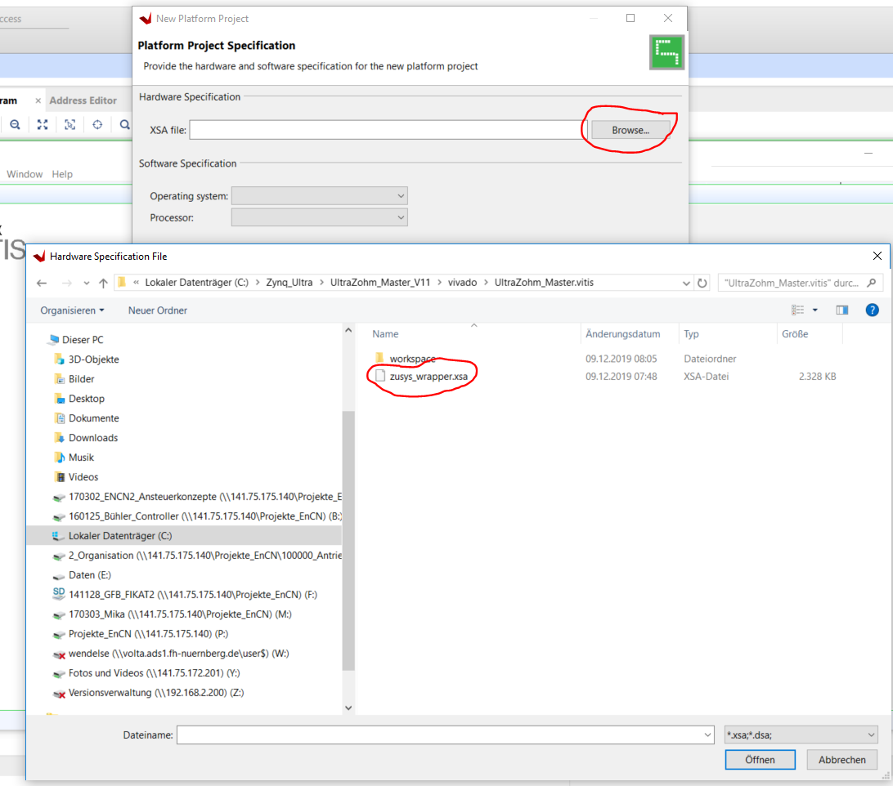

2. Activate the creation of a Boot Image

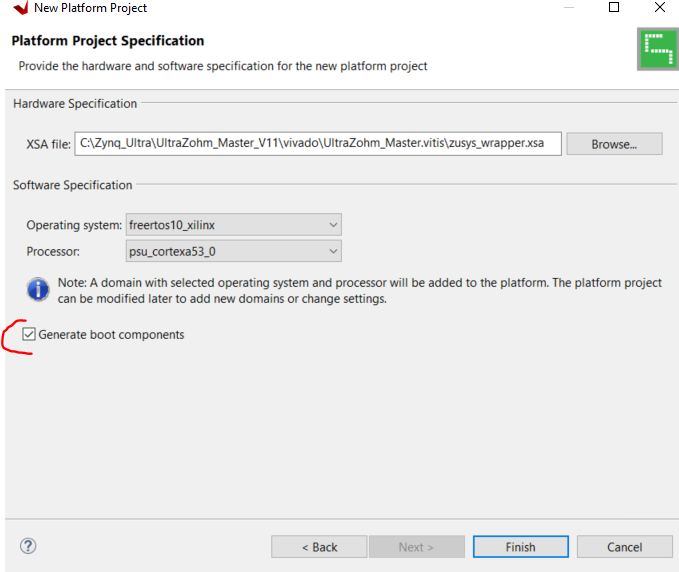

3. Afterwards, you have the Platform project ready. You have to do this only once.

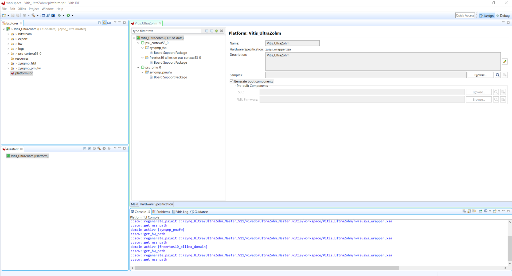

4. Add the LW-IP-Ethernet IP-Core
	
	1. Right click on the FreeRTOS BSP
	2. Modify BSP settings
	
	.. image:: ./images_create/vitis_create11.png

	3. Add the IP-Core
	
	.. image:: ./images_create/vitis_create12.png
	
5. Build the platform especially if the platform is "out-of-date"

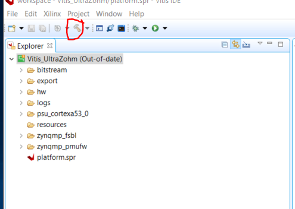

The Application Project
-----------------------

Next step will be to create an "Application Project" for each different solution. 

FreeRTOS
^^^^^^^^

1. In our case we have one processor of the A53 for the FreeRTOS:

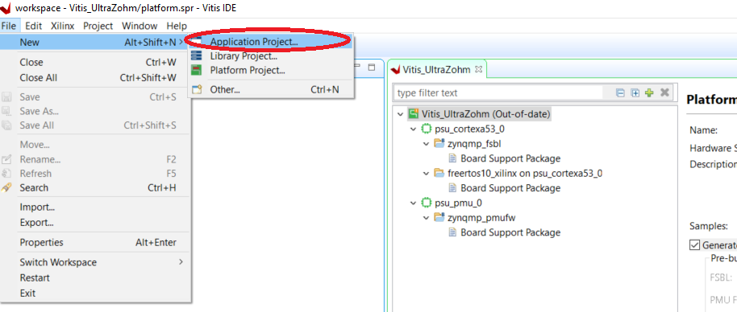
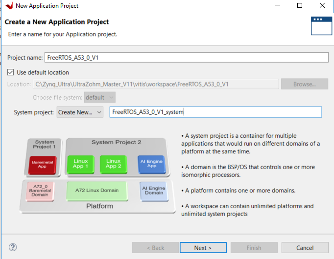
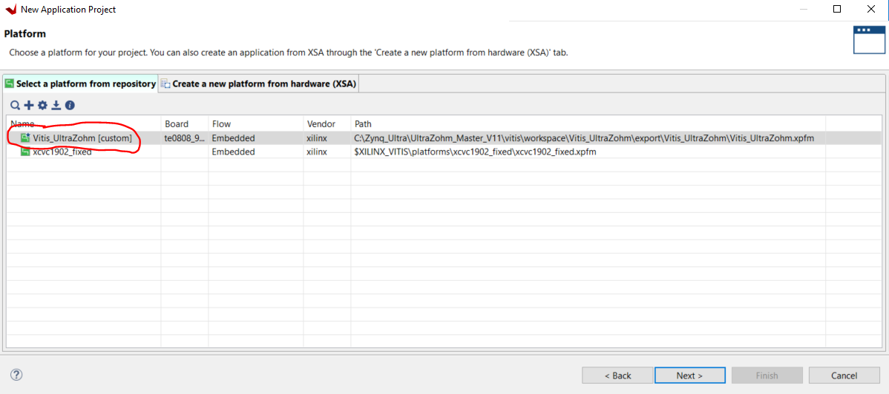

2. If the necessary Platform is not shown, press the "+" and select the "ProjectName.xpfm" file from the path manually.

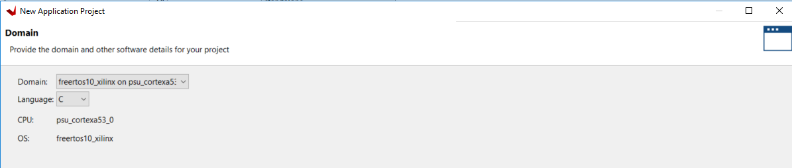

3. The following step works only if the LW-IP was included before:

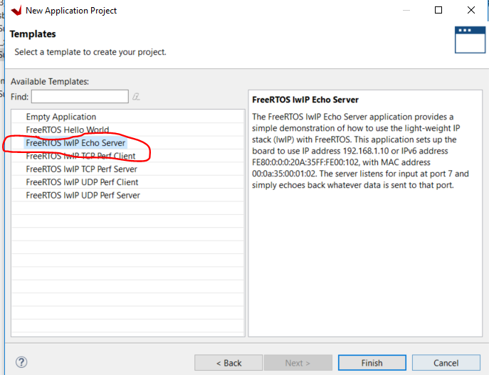

4. Press Finish

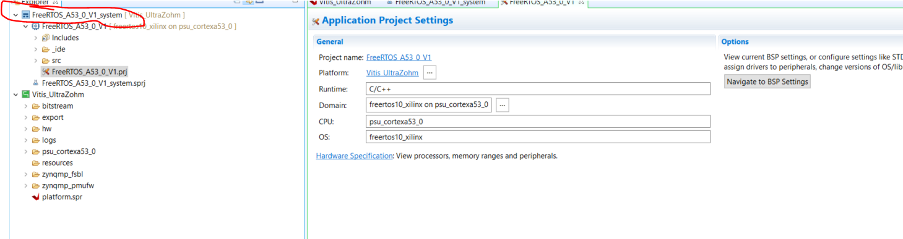

5. You will see the name of the "Platform Project", on which the "Application Project" is based on, in the yellow brackets behind the application.

Bare Metal
^^^^^^^^^^

We will use one processor of the R5 for the Bare Metal application

1. Since during creation of the "platform Design" we just created a "System project" for the A53_0, we now have to do the same manually for the R5
2. Right click on the "Vitis_UltraZohm" and add a domain

.. image:: ./images_create/vitis_create20.png
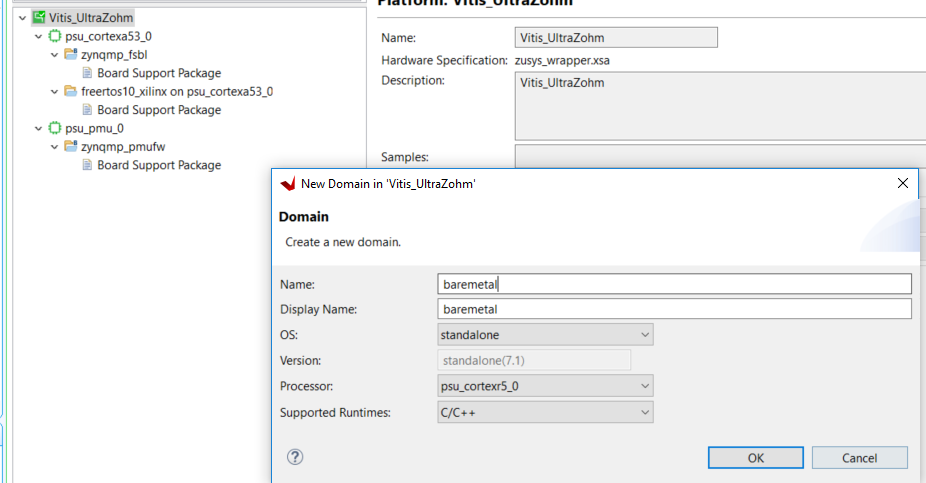

3. You should see the domain now. Rename the FreeRTOS to just `freertos`

.. image:: ./images_create/vitis_create22.png

4. Rebuild the platform project since it is out-of-date (yellow comment)

5. Add the new application project.

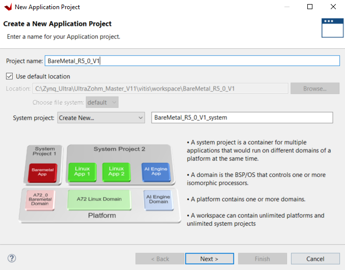

Side comment: If there is already another Platform and Application present in VITIS, it may happen, that the new domain is not visible.
In this case, it is necessary to delete the old/other Platform and Application. Afterwards, the new domain, e.g. for BareMetal is visible.

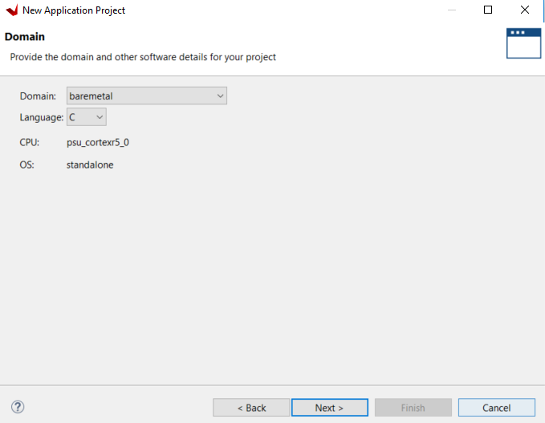
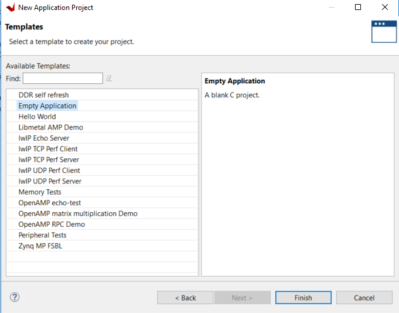

C-Project Setup
---------------

The project structure should be ready at this time.

1. Include the source (.c) and header (.h) files

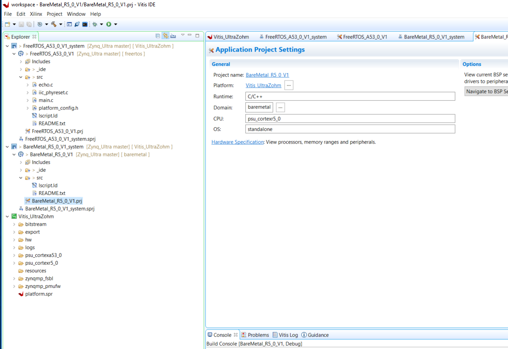

2. Make sure that the **UltraZohm linker script** is included.

.. image:: ./images_create/vitis_create27.png

3. At this moment the system is ready for modifications

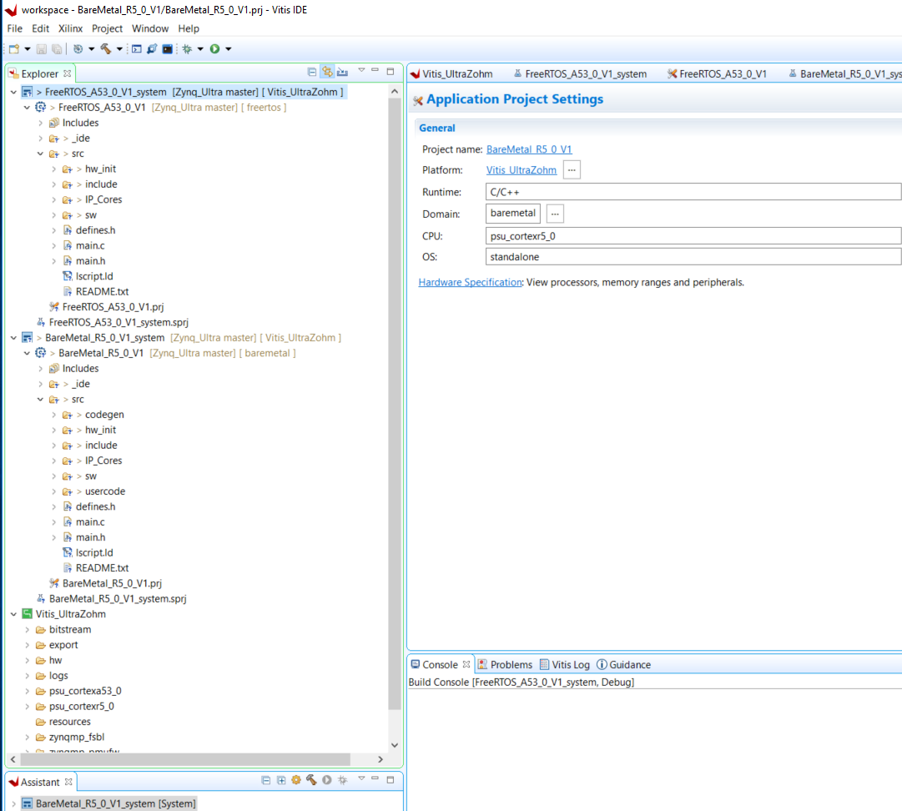

4. You can start a debug session now

.. image:: ./images_create/vitis_create29.png