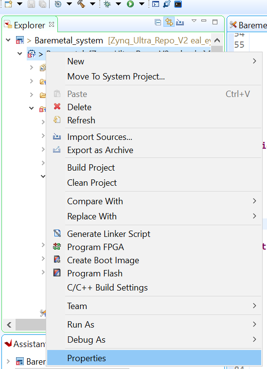
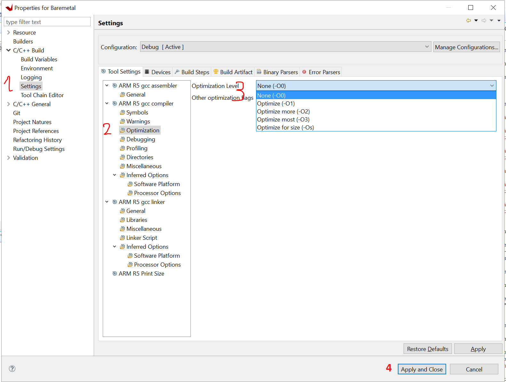

=========================================
Optimization Levels of the Compiler 
=========================================

* You can tell the compiler to use different levels of optimization. 
* For debugging it is recommended to use the None -O0 option.   
* `Introduction to optimization levels <https://www.linuxtopia.org/online_books/an_introduction_to_gcc/gccintro_49.html>`_

**Step-by-step**
^^^^^^^^^^^^^^^^^^

Open the project properties 

Change the optimization level by following the steps:

1. C/C++ build -> Settings
2. ARM R5 gcc compiler -> Optimization
3. Optimization Level -> pull down menu to chose the desired level
4. Apply and Close

