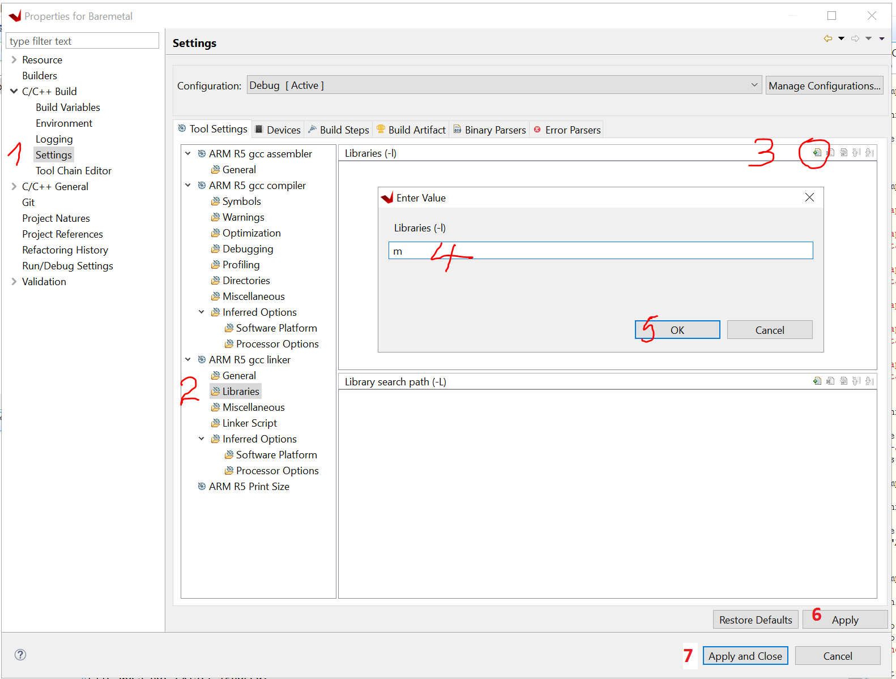

.. _math_h_prob:

======================
Include math.h lib 
======================

.. note:: In the standard UltraZohm software, the generate workspace .tcl script should take care of this!

If the compiler throws an error when using functions from math.h, you will have to tell the compiler to link the standard math library.

Open the project properties 

.. image:: ./images_problems/include_math_lib1.png
   :height: 400

Add the math library by going through the steps.

1. C/C++ build -> Settings
2. ARM R5 gcc linker -> libraries
3. Small button Add...
4. Type in "m"
5. Ok 
6. **Apply**
7. Apply and Close

