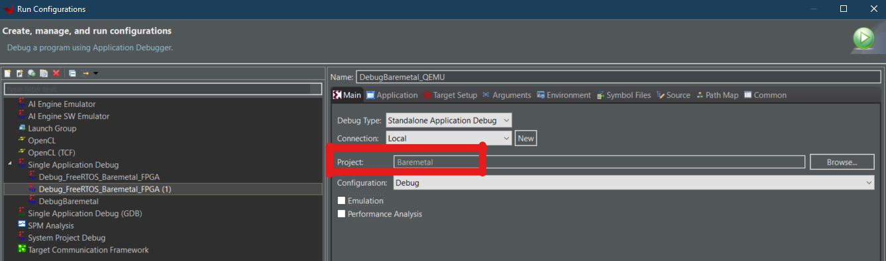
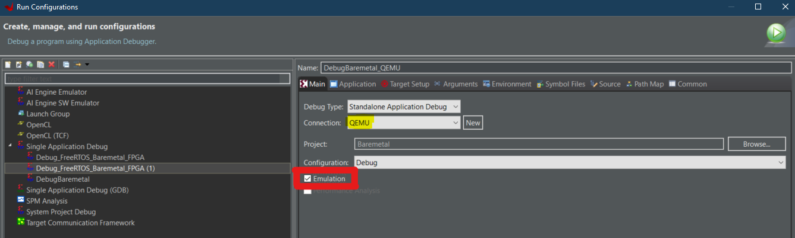

============================
Xilinx Quick Emulator (QEMU)
============================

How to use QEMU for baremetal application
*****************************************

This guide adapts the `Standalone Application Debug using System Debugger on QEMU <https://www.xilinx.com/html_docs/xilinx2019_2/vitis_doc/Chunk979461284.html?hl=qemu>`_ guide.

1. Launch Vitis IDE
2. Open the UltraZohm workspace: ``~/ultrazohm/ultrazohm_sw/vitis/workspace``
3. Select **Run > Debug Configurations**
4. Right click on ``Debug_FreeRTOS_Baremetal_FPGA`` and select **duplicate**

.. image:: Debug_config_create.png

5. Change the name to ``Debug_Baremetal_QEMU``

6. Change the project to ``Baremetal``

7. Check the **Emulation** box. The **connection** should automatically change to ``QMEU``

8. Don't change any other settings
9. Click **Apply** and then **run**
10. Click **Start Emulator and Run**
11. The **emulation console** should open. If it doesn't, go to **Window > Show view > Xilinx > Emulation Console**
12. To stop the Emulator, go to **Xilinx > Start/Stop Emulator**

 

Further information to setup the QEMU emulation for vitis 2020.1
****************************************************************

Documentation using QEMU with the Vitis IDE is sparse. The following links mostly reference the old SKD environment. 

1. `Xilinx Quick Emulator User Guide QEMU (v2020.1) <https://www.xilinx.com/support/documentation/sw_manuals/xilinx2020_1/ug1169-xilinx-qemu.pdf>`_ . To use this system emulation model you must be familiar with:
    
    * Uses **Xilinx® PetaLinux** and Software DevelopmentKit (SDK) tools

    
2. `Introduction to QEMU <https://www.xilinx.com/video/soc/introduction-to-qemu.html>`_
    
    * Short explanation how QEMU works and for what you can use it
    * No information how to set up/start the emulator
    
    
3. `Running an RPU Application using QEMU <https://www.xilinx.com/video/soc/running-an-rpu-application-using-qemu.html>`_ 
    
    * Old video, still uses the SDK instead of the Vitis IDE
    * Outdated workflow

	
	
	