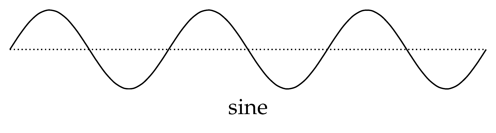
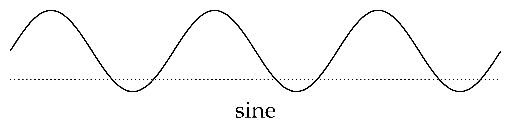
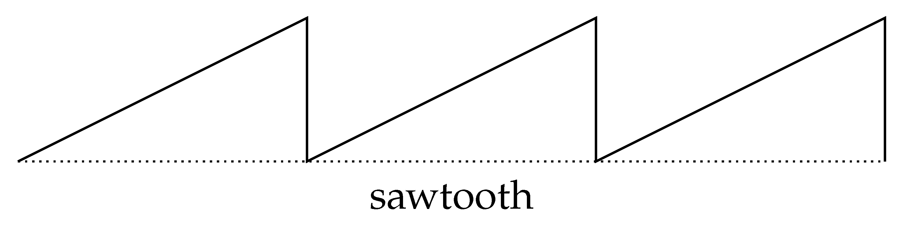
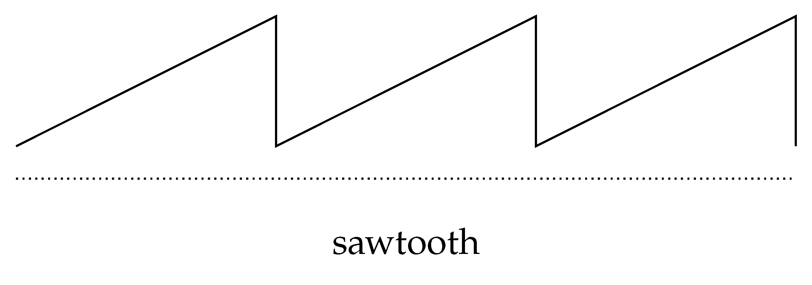
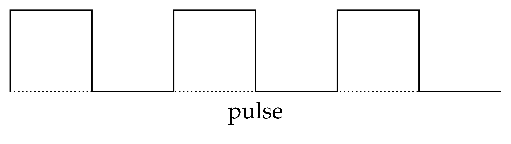
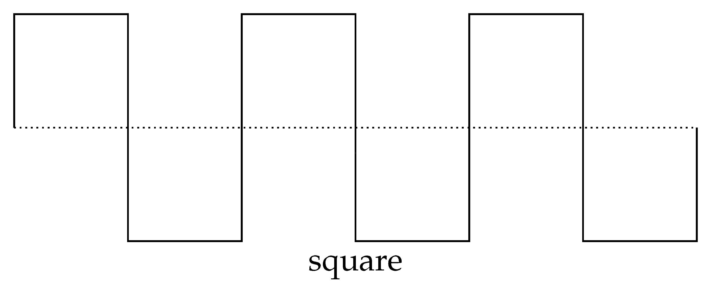
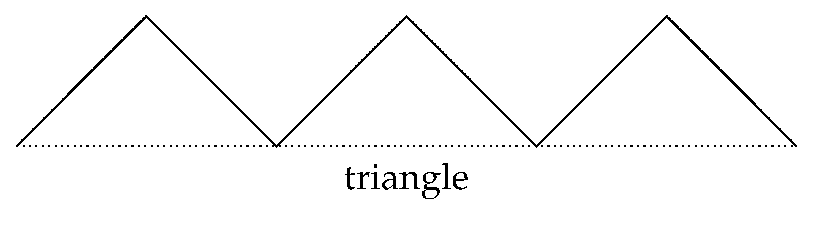
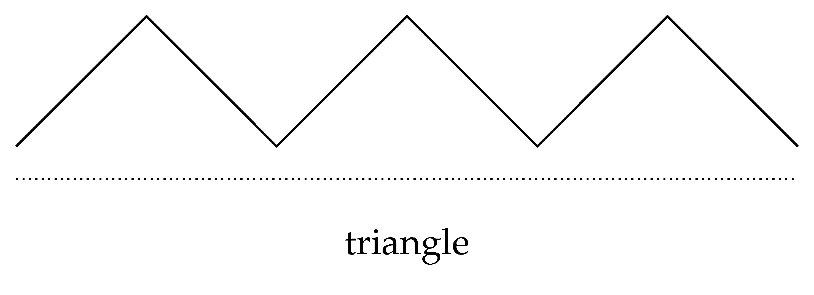
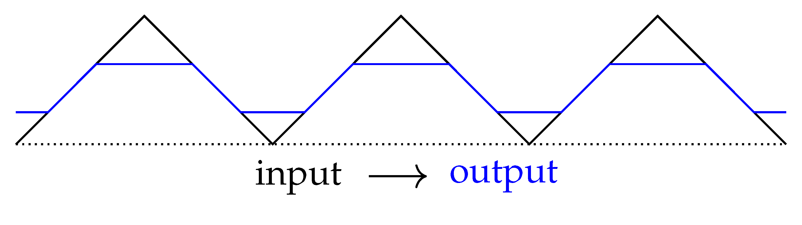
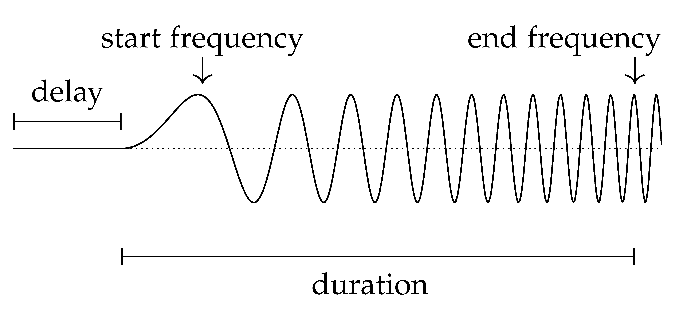

.. _wave_generator:

==================
Waveform Generator
==================

The ``uz_wavegen`` functions can be used to create standard waveform, which, for example, can be displayed in the :ref:`JavaScope`.

Avaivable waveforms
*******************

Sine wave
^^^^^^^^^

   
Creates a continous sine wave. 

.. list-table:: Required input arguments
   :widths: 25 25 25
   :header-rows: 1

   * - argument
     - value
     - unit
   * - amplitude
     - +/- float
     - 
   * - frequency
     - \+ float 
     - Hz

Function call:

.. code-block:: c

    ... = uz_wavegen_sine(amplitude, frequency_Hz);
    
Sine wave with offset
^^^^^^^^^^^^^^^^^^^^^

   
Creates a continous sine wave with an adjustable offset. 

.. list-table:: Required input arguments
   :widths: 25 25 25
   :header-rows: 1

   * - argument
     - value
     - unit
   * - amplitude
     - +/- float
     - 
   * - frequency
     - \+ float 
     - Hz
   * - offset
     - +/- float
     -

Function call:

.. code-block:: c

    ... = uz_wavegen_sine_with_offset(amplitude, frequency_Hz, offset);   

Sawtooth wave
^^^^^^^^^^^^^

    
Creates a continous sawtooth wave.

.. list-table:: Required input arguments
   :widths: 25 25 25
   :header-rows: 1

   * - argument
     - value
     - unit
   * - amplitude
     - +/- float
     - 
   * - frequency
     - \+ float 
     - Hz

Function call:

.. code-block:: c

    ... = uz_wavegen_sawtooth(amplitude, frequency_Hz);
    
Sawtooth wave with offset
^^^^^^^^^^^^^^^^^^^^^^^^^

    
Creates a continous sawtooth wave with an adjustable offset.

.. list-table:: Required input arguments
   :widths: 25 25 25
   :header-rows: 1

   * - argument
     - value
     - unit
   * - amplitude
     - +/- float
     - 
   * - frequency
     - \+ float 
     - Hz
   * - offset
     - +/- float
     -

Function call:

.. code-block:: c

    ... = uz_wavegen_sawtooth_with_offset(amplitude, frequency_Hz, offset);
    
Pulse wave
^^^^^^^^^^^^^

    
Creates a continous pulse wave.

.. list-table:: Required input arguments
   :widths: 25 25 25
   :header-rows: 1

   * - argument
     - value
     - unit
   * - amplitude
     - +/- float
     - 
   * - frequency
     - \+ float 
     - Hz
   * - DutyCycle
     - float 0.0 -> 1.0
     -
  
Function call:

.. code-block:: c

    ... = uz_wavegen_pulse(amplitude, frequency_Hz, duty_cycle);

Square wave
^^^^^^^^^^^^^

    
Creates a continous square wave.

.. list-table:: Required input arguments
   :widths: 25 25 25
   :header-rows: 1

   * - argument
     - value
     - unit
   * - amplitude
     - +/- float
     - 
   * - frequency
     - \+ float 
     - Hz

Function call:

.. code-block:: c

    ... = uz_wavegen_square(amplitude, frequency_Hz);

Triangle wave
^^^^^^^^^^^^^

    
Creates a continous triangle wave.

.. list-table:: Required input arguments
   :widths: 25 25 25
   :header-rows: 1

   * - argument
     - value
     - unit
   * - amplitude
     - +/- float
     - 
   * - frequency
     - \+ float 
     - Hz

Function call:

.. code-block:: c

    ... = uz_wavegen_triangle(amplitude, frequency_Hz);
    
Triangle wave with offset
^^^^^^^^^^^^^^^^^^^^^^^^^

    
Creates a continous triangle wave with an adjustable offset.

.. list-table:: Required input arguments
   :widths: 25 25 25
   :header-rows: 1

   * - argument
     - value
     - unit
   * - amplitude
     - +/- float
     - 
   * - frequency
     - \+ float 
     - Hz
   * - offset
     - +/- offset
     - 

Function call:

.. code-block:: c

    ... = uz_wavegen_triangle(amplitude, frequency_Hz, offset);

Saturation function
^^^^^^^^^^^^^^^^^^^

Limits an input signal to the upper and lower saturation values, similiar to how the saturation block in matlab functions. Doesn't generate a waveform by itself.

.. list-table:: Required input arguments
   :widths: 25 25 25
   :header-rows: 1

   * - argument
     - value
     - unit
   * - input signal
     - +/- float
     - 
   * - upper limit
     - +/- float 
     - 
   * - lower limit
     - +/- float 
     -

Function call:

.. code-block:: c

    ... = uz_wavegen_saturation(input, upper_limit, lower_limit);
    
Chirp function
^^^^^^^^^^^^^^

Creates a configurable chirp function. The parameters for configuration are the amplitude, the start and end frequency, the duration for the chirp and a delay for the start of the chirp wave. For the input argmuents a struct is needed.

.. list-table:: Required input arguments
   :widths: 25 25 25
   :header-rows: 1

   * - argument
     - value
     - unit
   * - is_ready
     - true/false
     - 
   * - amplitude
     - +/- float 
     - 
   * - start_frequency_Hz
     - \+ float 
     - Hz
   * - end_frequency_Hz
     - \+ float 
     - Hz
   * - duration
     - \+ float
     - seconds
   * - delay
     - 0 -> \+ float
     - seconds
  