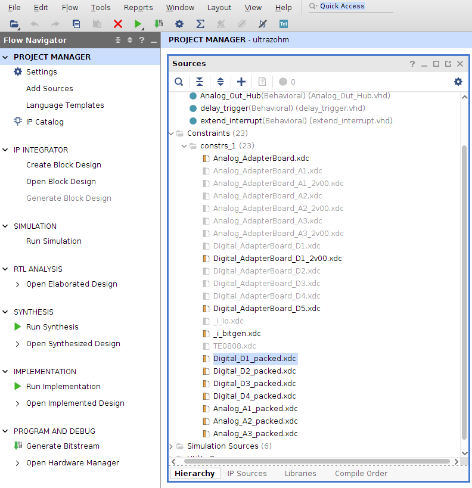
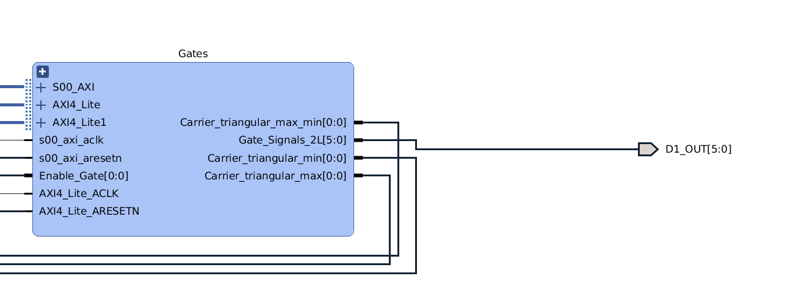
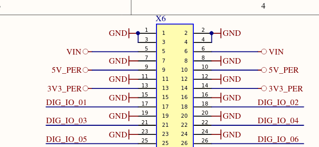

===========
Constraints
===========

The constraints are used to assign I/O ports to physical pins of the MPSoC by setting the property ``PACKAGE_PIN``.
Refer to the Xilinx documentation for more information about pin planning `Xilinx information <https://www.xilinx.com/support/documentation-navigation/design-hubs/dh0007-vivado-pin-planning-hub.html>`_.

.. _constraint_location:

    Location of the constraint files.

.. note::

    There are disabled constraint files in the project.
    Only use them if you have a version 1v5 of the carrier board!

Usage
*****

The I/O constraints (PIN Planning) are not meant to be changed since the pins of the MPSoC are routed to the adapter cards.
Use the output ports, e.g., D1_out if you want the signal of the PL to be routed to the digital adapter slot D1:

.. _constraint_ld1:

    I/O port D1_out[0..5]

The following code maps the ports D1_out to the PINs.

.. code::

    set_property PACKAGE_PIN AC9    [get_ports D1_OUT[0]]
    set_property PACKAGE_PIN AB9    [get_ports D1_OUT[1]]
    set_property PACKAGE_PIN AB10   [get_ports D1_OUT[2]]
    set_property PACKAGE_PIN AB11   [get_ports D1_OUT[3]]
    set_property PACKAGE_PIN AJ11   [get_ports D1_OUT[4]]
    set_property PACKAGE_PIN AK11   [get_ports D1_OUT[5]]

Schematic names
***************

The port name corresponds the signal name in the carrier board schematic and is routed to the digital and analog adapter card slots D1..D5 (X6) and A1..A3 (X5).

.. csv-table:: Mapping of Constraint to carrier board schematic version

   "Constraint","1v5", "v2", "v3", "v4"
   "D1_OUT[0..29]", "DIG_01_Ch..DIG_30Ch","DIG_01_Ch..DIG_30Ch","DIG_01_Ch..DIG_30Ch", "D1[0..29]"

The I/O ports D1_OUT[0..5] are routed to D1.

.. _d1_end:

    I/O port D1_out[0..5] at X6 with DIG_IO_01.._06