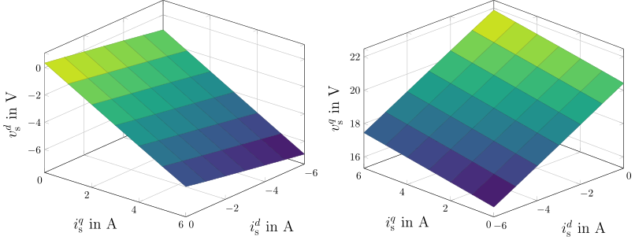
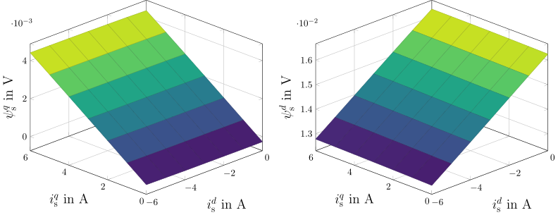

.. _uz_flux_maps_measuerement:

======================
Flux maps measurement
======================

This module implements a measurement routine for measuring flux maps in both motor and generator mode. 
If temperature measurement of the motor is available, the procedure can include heating and cooling phases between operating points to maintain a constant temperature throughout the entire measurement process.

.. _meas_process:

.. tikz:: schematic
  :align: center
  :xscale: 80

   \usetikzlibrary{arrows.meta, positioning, shapes}
   
   \newcommand{\windingTemperature}{{\vartheta}_{\mathrm{W}}}
   \newcommand{\windingTemperatureMin}{{\vartheta}_{\mathrm{W,min}}}
   \newcommand{\windingTemperatureMax}{{\vartheta}_{\mathrm{W,max}}}

  
   \tikzstyle{startstop} = [rectangle, rounded corners, draw, fill=black!0, text centered, minimum width=2cm, minimum height=1cm]
   \tikzstyle{process} = [rectangle, draw, fill=black!20, text centered, minimum width=2cm, minimum height=0.75cm]
   \tikzstyle{decision} = [diamond, draw, fill=black!10, text centered, aspect=1.5, inner sep=3pt]
   \tikzstyle{arrow} = [thick, ->, >=stealth]
   % Nodes
   \node (start) [startstop] {Start measurement};
   \node (initialize) [process, right = 1cm of start, align=center]
   {Set first operating point $k$};
   \node (measure) [process, below = 0.5cm of initialize, align=center] {Wait for $t >> \tau_{max}$\\Measure data};
   \node (tempavail) [decision, below = 0.5cm of measure, align=center] {Check motor \\ temperature?};
   \node (tempcheck) [decision, below = 1cm of tempavail, align=center] {Temperature within \\ limits?\\ $\windingTemperatureMin < \windingTemperature < \windingTemperatureMax$};
   \node (heating) [process, left=1.5cm of tempcheck, align=center] {$\windingTemperature > \windingTemperatureMax$:\\ Cooling phase\\ $\windingTemperature < \windingTemperatureMin$:\\ Heating phase};
   \node (lastop) [decision, below=1cm of tempcheck, align=center]{$k=K$?};
   \node (nextop) [process, right=3.5cm of lastop] {$k+1$};
   \node (finish) [startstop, left=1.5cm of lastop, align=center] {Stop measurement\\Store data};
   % Connections
   \draw [arrow] (start) -- (initialize);
   \draw [arrow] (initialize) -- (measure);
   \draw [arrow] (measure) -- (tempavail);
   \draw [arrow] (tempavail) -- node[right]{Yes} (tempcheck);
   \draw [arrow] (tempavail) -- ++(4.5cm, 0cm) |- ++(0cm, -5.5cm) -- node[above]{No} (lastop);
   \draw [arrow] (tempcheck) -- node[above]{No} (heating);
   \draw [arrow] (heating) |- (tempcheck.west);
   \draw [arrow] (tempcheck) -- node[right]{Yes} (lastop);
   \draw [arrow] (lastop) -- node[above]{No} (nextop);
   \draw [arrow] (nextop) |- (measure);
   \draw [arrow] (lastop) -- node[above]{Yes} (finish);

The measuruement process is depicted in :numref:`meas_process`.

.. _udq_2500rpm:

   test caption

:numref:`udq_2500rpm` shows result from measurement

.. math::

   \Psi_d = \frac{v_q - R_s i_q}{\omega_{el}} \\
   \Psi_q = \frac{v_d - R_s i_d}{-\omega_{el}}

.. _psidq_3000rpm:

   test caption two

:numref:`psidq_3000rpm` shows result from measurement

Setup
=====

Configuration
-------------

In order to configure the measurement procedure, multiple configuration structs have to be initialized.

Example
^^^^^^^
    
.. code-block:: c
  :linenos:
  :caption: Example to initialize the configuration struct
    
   #include "uz/uz_ParameterID_rc/uz_ParameterID_rc.h"
   int main(void)
   {
      int status = UZ_SUCCESS;

      const struct uz_parameterID_rc_config_t rc_meas_config = {
         .abs_id_max_Amps = 6.0f,
         .abs_iq_max_Amps = 6.0f,
         .n_start_rpm = 500.0f,
         .n_stop_rpm = 3000.0f,
         .id_steps = 6U,
         .iq_steps = 6U,
         .n_steps = 5U,
         .check_temp = 1
         };

Init function
-------------

.. doxygenfunction:: uz_parameterID_rc_init
.. doxygentypedef:: uz_parameterID_rc_t
.. doxygenstruct:: uz_parameterID_rc_config_t
   :members:

Example
^^^^^^^

Description
^^^^^^^^^^^