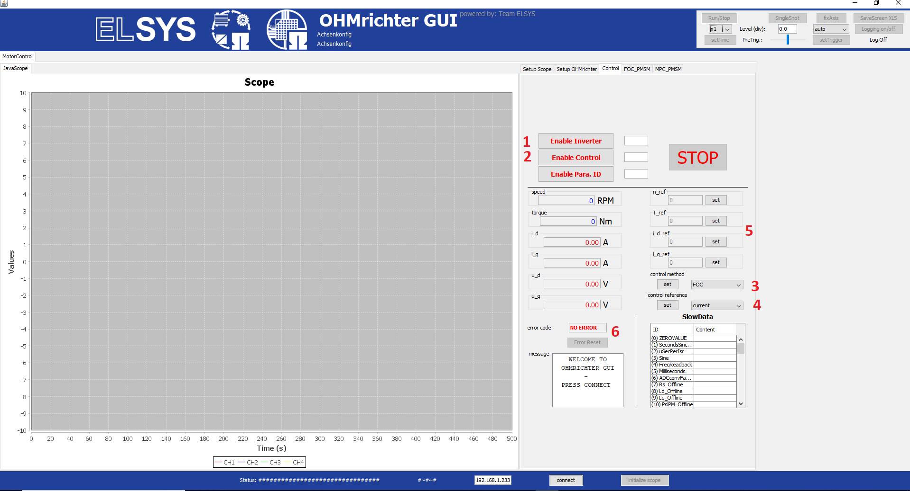
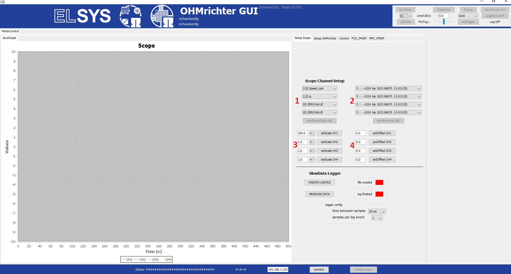

.. _JavaScope:

=========
JavaScope
=========

The JavaScope is located in the main ultrazohm_software repository in the folder  ``ultrazohm_sw\javascope``.
The folder contains the following files

- ``javascope_run.bat`` is the executable for Windows, start by double-clicking 
- ``javascope.h`` is the same header file as in Baremetal project, modify this to add variables
- ``OHMrichterGUI.jar`` is the binary build file of the JavaScope, the sources are in a separate repository
- ``properties.ini`` is the configuration file that is loaded when starting the JavaScope
- ``JS_plot_data.m`` is a Matlab script, that reads and plots the measurement data 
- ``lib`` is the folder including the required Java libraries

..	image:: ./images_javascope/folder_structure.jpg

..	image:: ./images_javascope/folder_structure_linux.jpg

	
Basics
------

The GUI looks like this. 

..	image:: ./images_javascope/gui1.png

1. First, press the button 1 in order to connect your scope to the UltraZohm.
	
2. You will see some moving signs at 2, if the connection was successful.
	
3. The JavaScope will be initialized by pressing the button 3.
	
4. At next, press the button 4 in order to run the scope.

5. In the time based scope it is possible to debug up to 4 values by receiving data from the ISR (R5 processor).

6. In the ``SlowData`` table it is possible to debug an almost endless number of values by receiving data from the ISR (R5 processor). However, this variables share on frame and are transfered in a chain. As more values are displayed, as longer it takes until they are updated.

Description of the buttons and pages
------------------------------------

Control page
""""""""""""

The control page is used to run/stop the system and makes the fundamental decisions about how the system will be used. 

1. The ``Enable Inverter`` button is the main button, which starts the system and enables the gate signals to pass through the CPLDs. 
     
	a. If this button is OFF, nothing will happen.
	 
	b. The main/big ``STOP`` button will also disables the ``Enable Inverter`` flag.
	 
	c. The subsequent ``control method`` and ``control reference`` can be only changed on the UltraZohm system, if the ``Enable Inverter`` button is switched OFF.
	 
	d. ON is indicated by a green light next/right to the button.
	
2. The ``Enable Control`` button is the one, which allows the specific control algorithm to write the control output to the modulator or gate signals. 
     
	a. If this button is OFF, the modulator will get an index of zero and no gate signals will be controlled.
	 
	b. The main/big ``STOP`` button will also deactivate the ``Enable Control`` flag.
	 
	c. The subsequent ``control method`` and ``control reference`` can be only changed on the UltraZohm system, if the ``Enable Control`` button is switched OFF.
	 
	d. ON is indicated by a green light next/right to the button.
	
3. The ``control method`` button is the one, which allows to change between different operation modes. Three possibilities are implemented by default. 
    
	a. DTC (Direct Torque Control)
	 
	b. FOC (Field Oriented Control)
	 
	c. MPC (Model Predictive Control)
	 
	Do not forget to press the ``set`` button always if you want to send a new method!
	 
	
4. The ``control reference`` button is the one, which allows to change between different references. Four possibilities are implemented by default. 
    
	a. torque
	 
	b. current
	 
	c. speed
	 
	d. position
	 
    Do not forget to press the ``set`` button always if you want to send a new kind of reference!
	 

5. The reference values can be set in dependent on the activated control reference.
    
	Do not forget to press the ``set`` button always if you want to send a new reference value!
	 
	 
6. The ``Error Reset`` button is the one, which allows to acknowledge errors after they occurred.
    
	a. The reset is only possible if the error is not present anymore.
	 
	b. All default treated errors get an reset if this button is pressed.

	 
Setup Scope page
""""""""""""""""

The Setup Scope page is used to adjust the scope settings during operation. 

1. Up to four channels, out of a predefined variable selection, can be chosen and displayed.
     
	a. The channel ``saw_tooth`` outputs a counter from the ISR and shows a kind of LifeCheck.
	 
	b. If other variables than the predefined ones are necessary, just change them in the ISR of the R5 processor.
	 
    Do not forget to press the ``sendSelectData`` button always if you want to change them! 

#. Each channel can have a specific scale factor.
     
	a. The scale factor is comparable to the scale factor of an oscilloscope. It changes the value per grid unit.
	 
    Do not forget to press the ``setScale`` button always if you want to change the scaling!

#. Each channel can have a specific offset.
     
	a. The offset factor is comparable to the offset factor of an oscilloscope. It allows to show just the change on the top of a signal.
	 
    Do not forget to press the ``setOffset`` button always if you want to change the offset!
	
	
Known issues
------------------------
.. warning::
   * If the Java Scope is distorted or the font is not readable, this may is due to an old Java version. 
   * If this is the case, just update you local Java version, as described in the **Install** section.

See also
"""""""""""""""

Designed by
"""""""""""
Philipp Loehdefink (THN), Sebastian Wendel (THN) in 08/2018

